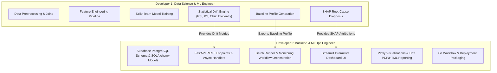
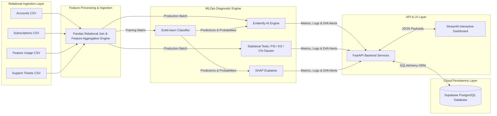

# Project Scope Document

**Project Title:** An Automated MLOps Framework for Monitoring and Diagnosing Model Degradation in Production  
**Document Version:** 1.0.0  
**Status:** Approved / Draft  
**Target Domain:** Machine Learning Operations (MLOps) / SaaS Analytics  
**Date:** September 2026  

---

## 1. Executive Summary

In modern enterprise Software-as-a-Service (SaaS) platforms, Machine Learning (ML) models predicting customer churn directly inform retention strategies, revenue forecasts, and customer success interventions. However, post-deployment model performance inevitably declines due to data drift (shifts in input feature distributions) and concept drift (changes in the statistical relationship between features and the target variable).

This project establishes an **Automated MLOps Monitoring and Diagnostic Framework** designed to perform post-deployment batch evaluation of a SaaS Customer Churn binary classifier. Utilizing the multi-table relational **RavenStack Synthetic SaaS Dataset**, the framework automates:
1. Multi-table data ingestion and relational feature aggregation.
2. Statistical data and prediction drift detection using **Evidently AI**, **Population Stability Index (PSI)**, **Kolmogorov-Smirnov (K-S)**, and **Chi-Square** tests.
3. Root-cause diagnosis using **SHAP (SHapley Additive exPlanations)**.
4. Persistent monitoring log storage via **Supabase (Cloud PostgreSQL)** using **SQLAlchemy ORM**.
5. Interactive dashboard visualization and alert reporting using **FastAPI** (Backend) and **Streamlit** (Frontend).

---

## 2. Problem Statement & Business Context

### 2.1 The SaaS Churn Monitoring Challenge
Predicting customer churn allows SaaS organizations to execute proactive retention plays. However, production ML models operate in dynamic environments where customer behavior, economic conditions, product feature rollouts, and pricing tiers continuously evolve.

Without continuous monitoring, Silent Model Failure occurs—where the binary classification model continues returning predictions without throwing runtime errors, but its statistical reliability, accuracy, and calibrated probabilities decay significantly.

### 2.2 Core Architectural Requirements
Existing generic monitoring tools often assume flat, pre-aggregated single-CSV datasets. The **RavenStack SaaS Dataset** mirrors real-world enterprise databases with normalized multi-table relational structures (Accounts, Subscriptions, Usage Logs, Support Tickets). The proposed framework must natively support multi-table relational transformation while maintaining strict baseline-versus-production data alignment.

---

## 3. Project Objectives & Success Metrics

### 3.1 Primary Objectives
- **Relational Data Processing Pipeline:** Build an automated pipeline that ingests relational CSV tables, executes entity-level (`account_id`) feature engineering, and maintains deterministic schema validation.
- **Automated Drift Detection Engine:** Implement statistical drift analysis comparing incoming production batch data against baseline training reference profiles using PSI, K-S tests (continuous features), and Chi-Square tests (categorical features).
- **Explainable Failure Diagnosis (SHAP):** Integrate SHAP analysis to attribute post-deployment prediction shifts to specific feature importance shifts, isolating root causes of model degradation.
- **Production Storage & API Service:** Expose monitoring data through high-throughput FastAPI endpoints, backed by Supabase PostgreSQL database tables.
- **Interactive Monitoring Operations UI:** Deliver an intuitive Streamlit dashboard providing drill-down drift reports, confusion matrix decay tracking, and automated alert triggering.

### 3.2 Key Performance Indicators (KPIs)

| Metric | Target / Benchmark | Measurement Method |
| :--- | :--- | :--- |
| **Drift Detection Latency** | < 10 seconds per 10k account records | Execution time of batch monitoring runner |
| **Statistical Drift Accuracy** | 0% false positives on stationary reference validation | Cross-validation on reference vs reference subsets |
| **Root-Cause Isolation Time** | Instantaneous (< 3s UI render) | SHAP summary plot execution & dashboard render time |
| **Database Sync Reliability** | 100% ACID compliance on logging batch runs | Supabase transaction audit and log verification |

---

## 4. System Boundaries: In-Scope vs. Out-of-Scope

### 4.1 In-Scope
- Ingestion and merging of the relational **RavenStack Dataset** (Accounts, Subscriptions, Feature Usage Logs, Support Tickets).
- Supervised binary classification model training (Scikit-learn Logistic Regression / Random Forest / XGBoost baseline).
- Batch monitoring pipeline execution (triggerable via UI / API / scheduled job).
- Baseline Profile statistical baseline creation during training.
- Statistical Drift Suite:
  - **Evidently AI** data drift and target drift reports.
  - **PSI (Population Stability Index)** for numerical distribution shifts.
  - **K-S (Kolmogorov-Smirnov)** test for continuous feature drift.
  - **Chi-Square ($\chi^2$)** test for categorical feature drift.
- **SHAP diagnosis module** analyzing globally shifted features and local degraded predictions.
- **Supabase Cloud PostgreSQL** persistent storage for monitoring metrics, drift alerts, and batch execution logs.
- **FastAPI backend REST endpoints** handling monitoring workflows, triggering drift runs, and querying historic metrics.
- **Streamlit frontend dashboard** featuring interactive Plotly visualizations and downloadable PDF/HTML drift reports.

### 4.2 Out-of-Scope
- Real-time streaming event-driven monitoring (Kafka/Flink) – restricted to batch processing.
- Unsupervised automated online model re-training without human-in-the-loop validation.
- Deployment of models to real-time edge devices or embedded hardware.
- Identity and access management (IAM) enterprise SSO integration (simple API token/Basic auth used if needed).

---

## 5. Domain & Data Architecture: RavenStack Dataset Integration

### 5.1 Relational Architecture Design
The **RavenStack Synthetic SaaS Dataset** is structured into distinct relational entities linked by primary/foreign keys (`account_id`):

```mermaid
erdiagram
    ACCOUNTS ||--o{ SUBSCRIPTIONS : "has"
    ACCOUNTS ||--o{ FEATURE_USAGE : "generates"
    ACCOUNTS ||--o{ SUPPORT_TICKETS : "opens"
    ACCOUNTS ||--|| CHURN_TARGET : "evaluates"

    ACCOUNTS {
        string account_id PK
        string company_name
        string industry
        string company_size
        string signup_date
        string country
    }

    SUBSCRIPTIONS {
        string subscription_id PK
        string account_id FK
        string plan_tier
        float monthly_recurring_revenue
        string billing_frequency
        string auto_renew_flag
        string contract_start_date
    }

    FEATURE_USAGE {
        string usage_id PK
        string account_id FK
        string feature_name
        int daily_active_users
        int total_sessions
        int api_call_count
        string timestamp
    }

    SUPPORT_TICKETS {
        string ticket_id PK
        string account_id FK
        string priority
        int resolution_time_hours
        int csat_score
        string status
        string created_at
    }

    CHURN_TARGET {
        string account_id PK, FK
        int is_churned
        string churn_date
    }
```

### 5.2 Rationale for Relational Aggregation Strategy
*Why treat RavenStack as relational instead of flattening into a static single CSV prior to system entry?*
1. **Real-world Parity:** Production enterprise data exists in normalized PostgreSQL/Data Warehouses (e.g., Snowflake, BigQuery). Flattening obscures pipeline data quality bugs (such as duplicate event joins, time-travel data leakage, missing foreign key constraints).
2. **Drift Source Diagnosis:** By preserving relational boundaries until feature computation, drift can be explicitly pinpointed to specific operational upstream tables (e.g., support ticket resolution times spiking versus product usage declining).

---

## 6. Technology Stack & Architectural Decisions

| Layer | Chosen Technology | Architectural Rationale & Why Selected |
| :--- | :--- | :--- |
| **Language** | Python 3.10+ | De facto standard for MLOps, statistical computing, and backend ML integration. |
| **ML Engine** | Scikit-learn | Lightweight, standard API, robust classification baseline, seamlessly integrates with SHAP. |
| **Data Processing** | Pandas, NumPy | High-performance vector operations for relational table joins, aggregations, and windowing. |
| **Drift Engine** | Evidently AI | Industry standard for MLOps monitoring; generates comprehensive data quality and drift suites. |
| **Statistical Tests** | PSI, K-S Test, Chi-Square | **PSI:** Quantifies distribution shifts. **K-S:** Non-parametric continuous drift detection. **Chi-Square:** Validates categorical frequency shifts. |
| **Model Explainability** | SHAP | Game-theoretic feature attribution. Explains model behavior changes post-drift. |
| **Backend Framework** | FastAPI | High-speed async ASGI web framework, automatically generates OpenAPI specs, Pydantic type safety. |
| **Frontend Framework** | Streamlit | Rapid development of interactive data applications with native Python execution and Plotly support. |
| **Database** | Supabase (Cloud PostgreSQL) | Cloud-managed PostgreSQL providing robust relational persistence, ACID compliance, and SQL query power. |
| **ORM & Driver** | SQLAlchemy & psycopg2 | Decouples Python logic from raw SQL; provides transactional integrity and connection pooling. |
| **Visualization** | Plotly | Dynamic, interactive JavaScript-backed charts rendered seamlessly inside Streamlit. |

---

## 7. Team Responsibility Matrix (RACI Overview)

The project is executed by two core engineering roles:



---

## 8. High-Level Architecture Overview



---

## 9. Risk Assessment & Mitigation Strategies

| Risk Description | Severity | Impact | Mitigation Strategy |
| :--- | :--- | :--- | :--- |
| **Missing / Unmatched Relational Keys** | Medium | Join failures or empty feature rows in aggregation. | Enforce outer join defaults with explicit zero-filling / imputation schemas; log orphaned accounts. |
| **Small Sample Size False Positive Drift** | High | Statistical tests trigger alerts on small batch sizes. | Enforce minimum batch size threshold ($N \ge 100$) before running K-S and Chi-Square tests; configure PSI sensitivity bins. |
| **High Computational Latency from SHAP** | High | Dashboard timeouts during batch explanation. | Use `shap.TreeExplainer` or `KernelExplainer` sampling (max 500 records) to compute background values deterministically. |
| **Database Connection Exhaustion** | Medium | Streamlit reruns deplete PostgreSQL connection pool. | Implement SQLAlchemy connection pooling with explicit session management (`scoped_session` / context managers). |

---

## 10. Document Approval & Sign-Off

- **Prepared By:** Senior MLOps Solution Architect & Technical Lead
- **Reviewed By:** Lead Data Scientist & Senior Systems Engineer
- **Status:** Approved for Architectural Design & Implementation Phase

---
