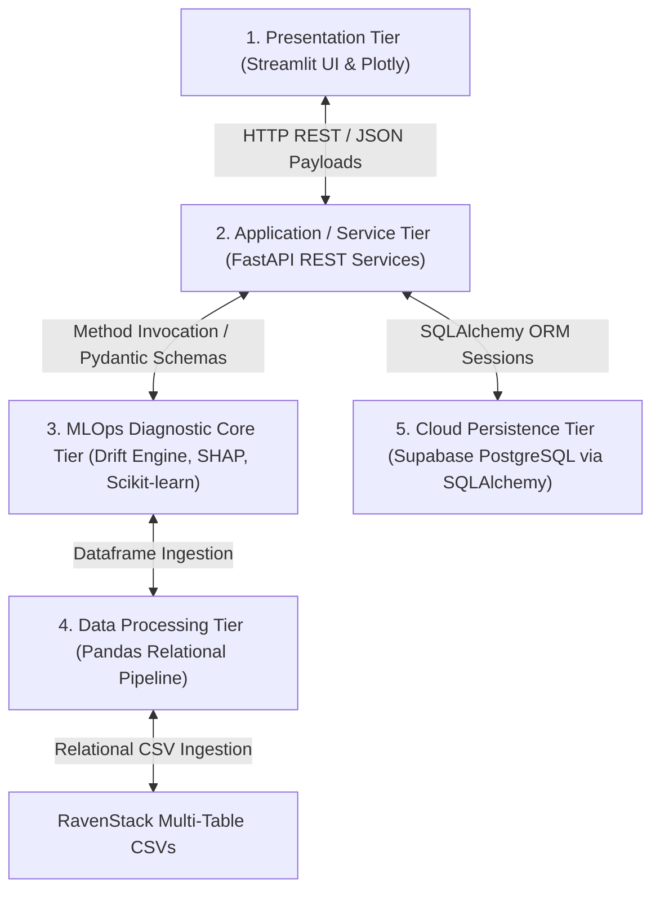
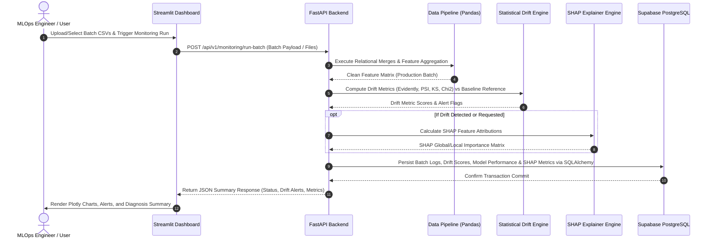
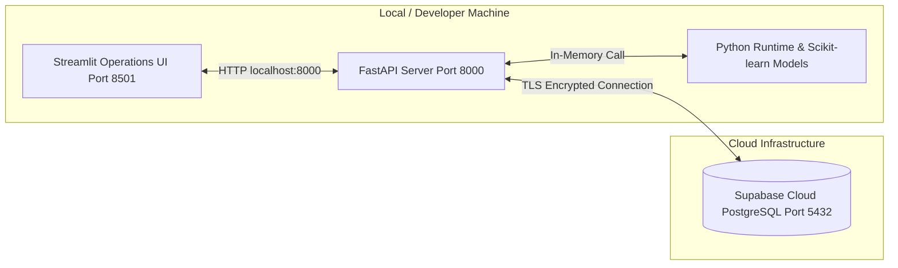

# Software Architecture Document (SAD)

**Project Title:** An Automated MLOps Framework for Monitoring and Diagnosing Model Degradation in Production  
**Document Version:** 1.0.0  
**Status:** Approved / Draft  
**Target Audience:** Senior Software Architects, Lead Developers, MLOps Engineers  
**Date:** September 2026  

---

## 1. Architectural Overview & Design Philosophy

### 1.1 Architectural Pattern: Modular Monolith
The framework is designed using a **Modular Monolith** architecture. While microservices introduce operational overhead (distributed logging, IPC latency, container orchestration), a modular monolith isolates concerns into clean Python packages (`ingestion`, `ml_engine`, `drift_engine`, `explainability`, `database`, `api`, `dashboard`). This yields maximum testability, rapid local development, and simple containerized or serverless deployment while retaining strict internal boundary separation.

### 1.2 Core Architectural Principles
- **Separation of Concerns (SoC):** Feature engineering logic is completely isolated from statistical drift computation and database persistence.
- **Relational Integrity First:** RavenStack multi-table datasets are processed using deterministic SQL/Pandas relational join specs prior to feature matrix construction.
- **Stateless Execution Services:** The FastAPI backend and Drift Detection services are stateless. All persistent states (baseline profiles, batch execution logs, drift scores, model metadata) are externalized into **Supabase Cloud PostgreSQL**.
- **Strategy Pattern for Drift Diagnostics:** Drift detection algorithms (PSI, K-S Test, Chi-Square, Evidently) are implemented as pluggable strategy modules under a unified diagnostic interface.

---

## 2. System Layered Architecture (Tiered View)

The system consists of five distinct architectural tiers:

---

## 3. Detailed Component Architecture

### 3.1 Data Ingestion & Relational Aggregation Engine
- **Input:** Multi-table CSV relational files from RavenStack (`accounts.csv`, `subscriptions.csv`, `feature_usage.csv`, `support_tickets.csv`).
- **Processing Logic:**
  - Performs inner/left outer joins on `account_id`.
  - Aggregates event-based data over sliding window intervals (e.g., total API calls per account over last 30 days, average ticket resolution time, sum of daily active users).
  - Handles missing value imputations and categorical encoding.
- **Output:** Cleaned entity-centric baseline or production batch DataFrame (`account_id` primary key + feature matrix).

### 3.2 Baseline Profile & Model Training Module
- **Model Engine:** Scikit-learn binary classification model (e.g., Random Forest / Logistic Regression / XGBoost).
- **Baseline Generator:** During offline training, computes statistical reference profiles (mean, standard deviation, quantiles, categorical frequency distributions, baseline metrics like Accuracy, Precision, Recall, F1, ROC-AUC).
- **Artifact Export:** Saves the trained Scikit-learn model pipeline (`model.pkl`) and baseline reference metadata JSON.

### 3.3 Drift Detection Subsystem
- **Evidently AI Pipeline:** Generates comprehensive Data Drift, Data Quality, and Target Drift HTML/JSON reports.
- **Custom Statistical Engine:**
  - **Population Stability Index (PSI):** Evaluates overall distribution shift for numerical features ($PSI < 0.1$: No change, $0.1 \le PSI < 0.25$: Moderate drift, $PSI \ge 0.25$: Significant drift).
  - **Kolmogorov-Smirnov (K-S) Test:** Non-parametric two-sample test comparing continuous feature distributions ($p\text{-value} < 0.05$ indicates significant drift).
  - **Chi-Square ($\chi^2$) Test:** Measures independence shift for categorical feature distributions ($p\text{-value} < 0.05$ indicates drift).

### 3.4 Explainability & Root-Cause Diagnosis Subsystem (SHAP)
- **Feature Attribution:** Calculates SHAP values using `shap.TreeExplainer` or `shap.Explainer` on degraded production batches.
- **Root-Cause Isolation:** Compares average absolute SHAP values between baseline training predictions and production batch predictions to identify which drifted features caused prediction degradation.

### 3.5 Cloud Persistence Layer (Supabase & SQLAlchemy)
- **Database Engine:** Supabase PostgreSQL instance.
- **ORM Mapping:** SQLAlchemy 2.0 mapping Python dataclass schemas to PostgreSQL tables (`batch_runs`, `feature_drift_logs`, `model_performance_logs`, `shap_importance_logs`).
- **Driver:** `psycopg2-binary` handling database connection pools.

### 3.6 Backend REST API (FastAPI)
- **Responsibilities:**
  - Triggers batch monitoring runs asynchronously.
  - Exposes endpoints to retrieve historical drift trends, active alerts, performance degradation metrics, and SHAP summaries.
  - Manages ORM database session lifecycles.

### 3.7 Operations Dashboard (Streamlit & Plotly)
- **Responsibilities:**
  - Interactive web interface for MLOps engineers and model operators.
  - Visualizes real-time and historical drift metrics via Plotly charts.
  - Displays summary statistics, alert flags, confusion matrices, and SHAP breakdown plots.

---

## 4. Architectural Sequence & Component Interaction

---

## 5. Architectural Design Rationale & Alternatives Evaluated

| Design Decision | Chosen Approach | Alternative Considered | Rationale for Choice |
| :--- | :--- | :--- | :--- |
| **API Architecture** | FastAPI Backend + Streamlit UI | Direct Database Access inside Streamlit | Decoupling UI from business logic allows future UI replacements (React/Next.js) or automated CI/CD pipeline triggers via API without code duplication. |
| **Database Persistence** | Supabase Cloud PostgreSQL + SQLAlchemy ORM | Local SQLite / File-based JSON storage | Cloud PostgreSQL ensures multi-session persistence, concurrent access, SQL query power, and production-grade ACID compliance. |
| **Drift Engine Strategy** | Hybrid (Evidently AI + Custom PSI/KS/Chi2) | Pure Evidently AI alone | Custom statistical engines provide granular, programmable threshold control and lightweight API responses without heavy HTML rendering overhead. |
| **Explainability Engine** | SHAP (TreeExplainer) | LIME | SHAP is mathematically grounded in cooperative game theory (Shapley values), guarantees consistency and additivity, and handles tree-based ensembles efficiently. |
| **Data Processing** | In-Memory Pandas Aggregations | Apache Spark / Dask | Given the batch size of the RavenStack dataset ($10\text{k} - 100\text{k}$ records), Pandas provides optimal performance without distributed cluster management overhead. |

---

## 6. Non-Functional Requirements & Architectural Constraints

### 6.1 Performance & Latency
- **Batch Processing Throughput:** Process a batch of 10,000 multi-table customer records (join, feature engineer, drift calculation) in under 15 seconds.
- **API Response Time:** Read endpoints (historical drift metrics, alert logs) must respond within $< 300\text{ms}$.

### 6.2 Reliability & Fault Tolerance
- **Database Resilience:** Transient network dropouts to Supabase are handled via SQLAlchemy connection pool retry mechanisms (`pool_pre_ping=True`).
- **Data Validation Guardrails:** Input CSV batches missing critical primary keys (`account_id`) or schema types are rejected at the FastAPI Pydantic parsing layer with detailed HTTP 422 error reports.

### 6.3 Security & Environment Governance
- **Secret Management:** Supabase database URIs and API credentials are kept out of source control using `.env` environment files managed via `python-dotenv`.
- **Database Authorization:** Access to Supabase uses standard encrypted TLS/SSL connections with role-based database permissions.

---

## 7. Deployment Architecture View

---

## 8. Document Approval & Sign-Off

- **Prepared By:** Lead Software & MLOps Solution Architect  
- **Reviewed By:** Backend Technical Lead & Senior Data Engineer  
- **Status:** Approved for Core Component & Database Development  

---
