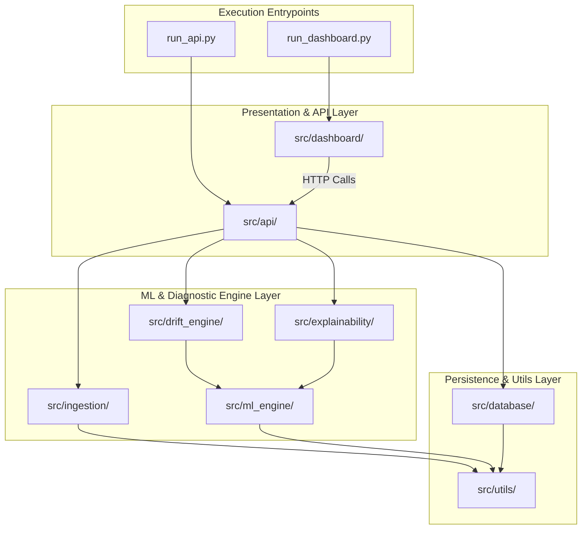

# Folder Structure Document

**Project Title:** An Automated MLOps Framework for Monitoring and Diagnosing Model Degradation in Production  
**Document Version:** 1.0.0  
**Status:** Approved / Draft  
**Target Audience:** Software Engineers, MLOps Engineers, Data Scientists  
**Date:** September 2026  

---

## 1. Directory Tree Overview

Below is the production-grade repository folder structure for the MLOps monitoring project. It adheres to standard Python package layouts (`src/` layout) to prevent import ambiguity and separate source code from datasets, artifacts, and documentation.

```text
Minor/
├── .env.example
├── .gitignore
├── README.md
├── requirements.txt
├── setup.py
├── run_api.py
├── run_dashboard.py
│
├── docs/
│   ├── 01_project_scope.md
│   ├── 02_software_architecture.md
│   ├── 03_folder_structure.md
│   ├── 04_github_workflow.md
│   ├── 05_development_roadmap.md
│   ├── 06_team_responsibility_matrix.md
│   ├── 07_database_design.md
│   ├── 08_api_design.md
│   ├── 09_module_design.md
│   ├── 10_data_flow.md
│   ├── 11_integration.md
│   ├── 12_file_specification.md
│   ├── 13_project_timeline.md
│   ├── 14_readme.md
│   ├── 15_software_design_document.md
│   ├── 16_coding_standards.md
│   └── 17_pre_development_checklist.md
│
├── data/
│   ├── raw/
│   │   ├── accounts.csv
│   │   ├── subscriptions.csv
│   │   ├── feature_usage.csv
│   │   ├── support_tickets.csv
│   │   └── churn_labels.csv
│   ├── processed/
│   │   ├── training_features.csv
│   │   └── production_batch_sample.csv
│   └── baseline/
│       └── baseline_reference.json
│
├── models/
│   ├── churn_model.pkl
│   ├── feature_scaler.pkl
│   └── model_metadata.json
│
├── src/
│   ├── __init__.py
│   │
│   ├── ingestion/
│   │   ├── __init__.py
│   │   ├── csv_loader.py
│   │   ├── relational_joiner.py
│   │   ├── feature_aggregator.py
│   │   └── schema_validator.py
│   │
│   ├── ml_engine/
│   │   ├── __init__.py
│   │   ├── trainer.py
│   │   ├── evaluator.py
│   │   ├── baseline_builder.py
│   │   └── predictor.py
│   │
│   ├── drift_engine/
│   │   ├── __init__.py
│   │   ├── psi_calculator.py
│   │   ├── ks_tester.py
│   │   ├── chi_square_tester.py
│   │   ├── evidently_runner.py
│   │   └── drift_evaluator.py
│   │
│   ├── explainability/
│   │   ├── __init__.py
│   │   ├── shap_explainer.py
│   │   └── root_cause_analyzer.py
│   │
│   ├── database/
│   │   ├── __init__.py
│   │   ├── connection.py
│   │   ├── models.py
│   │   ├── schemas.py
│   │   └── repository.py
│   │
│   ├── api/
│   │   ├── __init__.py
│   │   ├── app.py
│   │   ├── dependencies.py
│   │   └── routers/
│   │       ├── __init__.py
│   │       ├── health.py
│   │       ├── monitoring.py
│   │       ├── drift.py
│   │       └── explainability.py
│   │
│   ├── dashboard/
│   │   ├── __init__.py
│   │   ├── app.py
│   │   ├── components/
│   │   │   ├── __init__.py
│   │   │   ├── metric_cards.py
│   │   │   ├── drift_charts.py
│   │   │   └── shap_plots.py
│   │   └── pages/
│   │       ├── 1_Overview.py
│   │       ├── 2_Drift_Analysis.py
│   │       ├── 3_SHAP_Diagnosis.py
│   │       └── 4_Historical_Logs.py
│   │
│   └── utils/
│       ├── __init__.py
│       ├── config.py
│       ├── logger.py
│       └── constants.py
│
└── tests/
    ├── __init__.py
    ├── conftest.py
    ├── unit/
    │   ├── test_ingestion.py
    │   ├── test_drift_engine.py
    │   ├── test_explainability.py
    │   └── test_database.py
    └── integration/
        ├── test_api_endpoints.py
        └── test_end_to_end_pipeline.py
```

---

## 2. Directory Purpose & Detailed Specification

### 2.1 Project Root Level
- **`run_api.py`:** Main execution script launching the FastAPI ASGI server (`uvicorn src.api.app:app --reload --port 8000`).
- **`run_dashboard.py`:** Main execution script launching the Streamlit operations UI (`streamlit run src/dashboard/app.py --server.port 8501`).
- **`requirements.txt`:** Explicitly versions all Python dependencies (e.g., `scikit-learn==1.3.2`, `evidently==0.4.11`, `shap==0.44.0`, `fastapi==0.104.1`, `sqlalchemy==2.0.23`).
- **`.env.example`:** Template file specifying required environment variables (`SUPABASE_DB_URL`, `API_HOST`, `LOG_LEVEL`).

### 2.2 `docs/` Directory
Contains all system design, architecture, API, database, and operational documentation in markdown format.

### 2.3 `data/` Directory
- **`data/raw/`:** Local storage for the raw multi-table RavenStack SaaS CSVs (`accounts.csv`, `subscriptions.csv`, `feature_usage.csv`, `support_tickets.csv`, `churn_labels.csv`).
- **`data/processed/`:** Target destination for engineered single-row-per-account feature matrices generated by `src/ingestion/`.
- **`data/baseline/`:** Stores `baseline_reference.json`, containing reference feature distributions (means, standard deviations, categorical frequency arrays) computed during training.

### 2.4 `models/` Directory
Stores binary classifier artifacts (`churn_model.pkl`), feature transformers (`feature_scaler.pkl`), and metadata records (`model_metadata.json` containing training performance metrics and feature column ordering).

### 2.5 `src/` Source Code Modules

| Subsystem Package | Lead Developer Ownership | Responsibility Description |
| :--- | :--- | :--- |
| **`src/ingestion/`** | Developer 1 (DS/ML) | Ingests relational CSV tables, executes joins on `account_id`, computes aggregations, validates data types. |
| **`src/ml_engine/`** | Developer 1 (DS/ML) | Trains Scikit-learn classifier, generates baseline statistical profile, evaluates test performance. |
| **`src/drift_engine/`** | Developer 1 (DS/ML) | Calculates statistical drift scores (PSI, K-S test, Chi-Square test) and runs Evidently AI data drift reports. |
| **`src/explainability/`** | Developer 1 (DS/ML) | Wraps SHAP explainer routines to compute feature attributions for degraded production batches. |
| **`src/database/`** | Developer 2 (Backend) | Defines SQLAlchemy ORM models, manages Supabase PostgreSQL connections, executes database CRUD queries. |
| **`src/api/`** | Developer 2 (Backend) | Implements FastAPI REST routers, Pydantic request/response schemas, CORS, and endpoint dependency injection. |
| **`src/dashboard/`** | Developer 2 (Backend) | Streamlit multi-page dashboard layout, interactive Plotly visualization components, and API client calls. |
| **`src/utils/`** | Developer 1 & 2 (Shared) | Configuration loaders (`pydantic-settings`), logging setup, static constants (drift threshold limits). |

---

## 3. Package Dependency & Import Flow (Mermaid Diagram)



---

## 4. Architectural Design Rationale for Folder Layout

1. **`src/` Package Isolation:** Prevents root directory pollution and avoids accidental module name shadowing (e.g., creating a file named `logging.py` in root which shadows standard library `logging`).
2. **Explicit Data Separation (`data/raw` vs `data/processed`):** Enforces immutability of raw RavenStack CSV tables. Raw data is never overwritten; transformations exist only in `processed/`.
3. **Dedicated `models/` Directory:** Ensures serialized ML model artifacts and baseline distribution JSONs are version-controlled or tracked via artifact registries independently of source code.
4. **Decoupled Streamlit Pages (`src/dashboard/pages/`):** Streamlit natively turns multi-file scripts in `pages/` into side-navigated multi-page web interfaces without redundant router code.

---

## 5. Document Approval & Sign-Off

- **Prepared By:** Senior MLOps Lead & System Architect  
- **Reviewed By:** Data Science Lead & Backend Engineer  
- **Status:** Approved for Development Execution  

---
