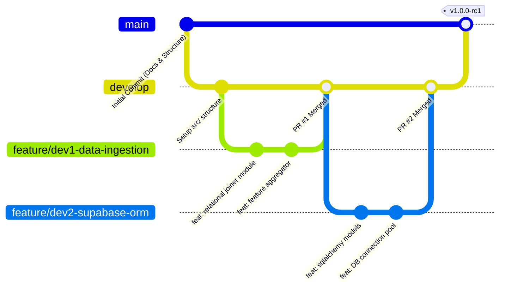
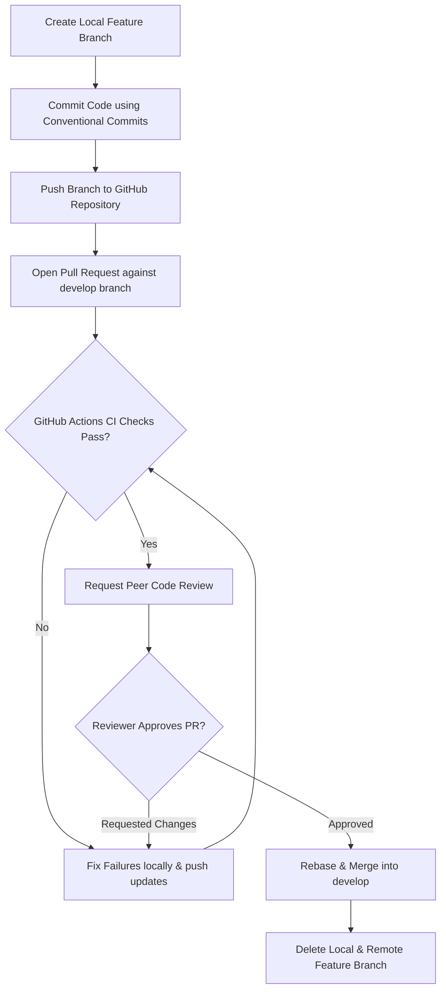

# GitHub Workflow & Version Control Document

**Project Title:** An Automated MLOps Framework for Monitoring and Diagnosing Model Degradation in Production  
**Document Version:** 1.0.0  
**Status:** Approved / Draft  
**Target Audience:** Developer 1 (DS/ML), Developer 2 (Backend/MLOps), Code Reviewers  
**Date:** September 2026  

---

## 1. Git Branching Strategy (Feature Branch Workflow)

The project adopts a structured **Feature Branch Workflow** optimized for a 2-developer engineering team. This workflow prevents direct commits to critical production branches, ensures code reviews, and maintains continuous integration stability.



---

## 2. Branch Hierarchy & Naming Conventions

### 2.1 Standard Branches
- **`main`:** Production-ready code. Must always be stable, tested, and deployable. Direct commits are strictly blocked by branch protection rules.
- **`develop`:** Integration branch where completed feature branches merge. Used for nightly/staging builds and end-to-end integration testing.

### 2.2 Working Branches Naming Schema

| Branch Type | Syntax / Pattern | Example Branch Name | Purpose / Responsibility |
| :--- | :--- | :--- | :--- |
| **Feature Branch** | `feature/dev<1\|2>-<short-description>` | `feature/dev1-drift-engine` | New feature implementation (Dev 1 or Dev 2). |
| **Bugfix Branch** | `bugfix/dev<1\|2>-<issue-key>` | `bugfix/dev2-db-connection-leak` | Fixing bugs found during integration on `develop`. |
| **Hotfix Branch** | `hotfix/<critical-issue-name>` | `hotfix/fastapi-cors-origin-fix` | Urgent resolution for severe production issues on `main`. |
| **Documentation** | `docs/<doc-name>` | `docs/api-specification` | Adding or updating architecture/API documentation. |

---

## 3. Commit Message Standards (Conventional Commits)

All commit messages MUST adhere to the **Conventional Commits** specification (`type(scope): description`).

### 3.1 Allowed Commit Types
- **`feat`:** A new feature introduced into the codebase. (e.g., `feat(drift): add PSI continuous metric calculation`).
- **`fix`:** A bug fix. (e.g., `fix(ingestion): handle missing support ticket account IDs`).
- **`docs`:** Documentation changes only. (e.g., `docs(arch): update database schema diagram`).
- **`refactor`:** Code change that neither fixes a bug nor adds a feature. (e.g., `refactor(api): convert sync endpoint to async handler`).
- **`test`:** Adding missing tests or correcting existing unit tests. (e.g., `test(ml): add unit test for model baseline generator`).
- **`chore`:** Build process, environment configuration, or dependency updates. (e.g., `chore(deps): bump evidently version to 0.4.11`).

### 3.2 Commit Structure Example
```text
feat(explainability): implement SHAP TreeExplainer for XGBoost model

- Integrated shap.TreeExplainer into src/explainability/shap_explainer.py
- Extracted top 5 global feature drift attributions
- Added unit test in tests/unit/test_explainability.py

Ref: #14
```

---

## 4. Pull Request (PR) & Code Review Protocol

### 4.1 PR Submission Rules
1. **No Direct Commits:** Neither Developer 1 nor Developer 2 may commit directly to `main` or `develop`.
2. **Atomic PR Size:** PRs must be scoped tightly (under 400 lines of code change) to ensure high-quality review.
3. **Peer Review Rule:** 
   - Code written by Developer 1 (DS/ML Engine) MUST be reviewed and approved by Developer 2 (Backend/MLOps).
   - Code written by Developer 2 (Backend/MLOps) MUST be reviewed and approved by Developer 1 (DS/ML Engine).

### 4.2 Pull Request Workflow (Mermaid Diagram)



---

## 5. Automated CI/CD Pipeline (GitHub Actions)

A GitHub Actions workflow file `.github/workflows/ci.yml` automatically triggers on every Push and Pull Request against `develop` and `main`.

### 5.1 CI Workflow Steps
1. **Linting & Code Formatting:** Executes `flake8` and `black --check` on `src/` and `tests/`.
2. **Type Checking:** Runs `mypy src/` for static type validation.
3. **Automated Unit Testing:** Executes `pytest tests/unit/ --cov=src` to ensure unit tests pass with a minimum 80% code coverage threshold.
4. **Integration Verification:** Runs end-to-end API and database transaction mock tests (`pytest tests/integration/`).

### 5.2 CI Workflow Configuration (`.github/workflows/ci.yml`)
```yaml
name: MLOps Monitoring Framework CI

on:
  push:
    branches: [ develop, main ]
  pull_request:
    branches: [ develop, main ]

jobs:
  test-and-lint:
    runs-on: ubuntu-latest

    steps:
      - name: Checkout Code
        uses: actions/checkout@v3

      - name: Set up Python 3.10
        uses: actions/setup-python@v4
        with:
          python-version: "3.10"

      - name: Install Dependencies
        run: |
          python -m pip install --upgrade pip
          pip install -r requirements.txt
          pip install pytest pytest-cov flake8 black mypy

      - name: Run Code Format Check (Black)
        run: black --check src/ tests/

      - name: Run Linting (Flake8)
        run: flake8 src/ tests/ --max-line-length=88

      - name: Run Unit Tests with Coverage
        run: pytest tests/unit/ --cov=src --cov-report=xml

      - name: Run Integration Tests
        run: pytest tests/integration/
        env:
          SUPABASE_DB_URL: ${{ secrets.SUPABASE_DB_TEST_URL }}
```

---

## 6. Branch Protection Rules & Conflict Resolution

### 6.1 Branch Protection Rules for `main` and `develop`
- **Require a pull request before merging:** Enabled (at least 1 approving review required).
- **Require status checks to pass before merging:** `test-and-lint` CI job must succeed.
- **Require linear history:** Enforced via `Rebase and Merge` policy.
- **Include administrators:** Enabled (prevents accidental force pushing even by admins).

### 6.2 Merge Conflict Resolution Protocol
1. Local feature branch owner is responsible for resolving merge conflicts.
2. The owner must run `git fetch origin` followed by `git rebase origin/develop` on their local feature branch.
3. Resolve inline code conflicts in VS Code, execute tests locally (`pytest`), and force push updated commits using `git push --force-with-lease`.

---

## 7. Document Approval & Sign-Off

- **Prepared By:** Technical Lead & Solution Architect  
- **Reviewed By:** Developer 1 (Data Science) & Developer 2 (Backend/MLOps)  
- **Status:** Approved for Project Governance  

---
