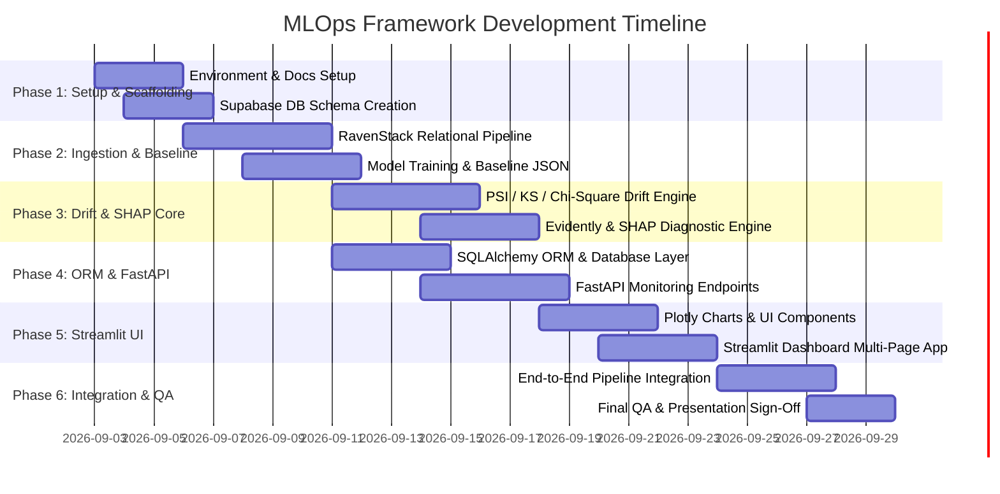
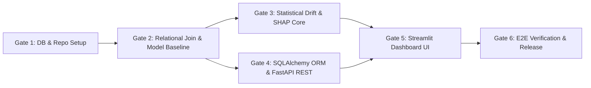

# Development Roadmap Document

**Project Title:** An Automated MLOps Framework for Monitoring and Diagnosing Model Degradation in Production  
**Document Version:** 1.0.0  
**Status:** Approved / Draft  
**Target Audience:** Project Manager, Technical Lead, Data Science & Backend Engineering Team  
**Date:** September 2026  

---

## 1. Executive Summary & Phased Implementation Strategy

The project development is structured into **6 sequential, milestone-driven phases**. This roadmap ensures parallel progress where possible between **Developer 1 (Data Science & ML)** and **Developer 2 (Backend & MLOps)** while defining strict integration gates to eliminate dependency bottlenecks.

---

## 2. Phase-by-Phase Implementation Breakdown

### Phase 1: Environment Setup, Database Provisioning & Repository Scaffolding
**Duration:** Days 1 – 3  
**Objective:** Establish source control, project directory layout, environment configuration, and cloud database instances.

- **Developer 1 Tasks:**
  - Initialize project GitHub repository and set up `.gitignore` and `requirements.txt`.
  - Create standard `src/` directory scaffolding (`ingestion`, `ml_engine`, `drift_engine`, `explainability`).
  - Prepare sample test subsets of RavenStack relational CSV files (`accounts.csv`, `subscriptions.csv`, `feature_usage.csv`, `support_tickets.csv`, `churn_labels.csv`).
- **Developer 2 Tasks:**
  - Provision Supabase Cloud PostgreSQL database instance.
  - Create base `.env.example` file and manage secrets.
  - Setup basic FastAPI and Streamlit entry points (`run_api.py`, `run_dashboard.py`).
  - Configure GitHub Actions CI workflow (`.github/workflows/ci.yml`).
- **Milestone Gate 1:** GitHub repository set up with passing CI lint checks and verified Supabase connection string.

---

### Phase 2: Relational Data Processing & Baseline Model Training Pipeline
**Duration:** Days 4 – 8  
**Objective:** Implement multi-table relational join logic and train initial baseline Scikit-learn churn model.

- **Developer 1 Tasks:**
  - Implement `src/ingestion/relational_joiner.py` to merge RavenStack CSVs on `account_id`.
  - Implement `src/ingestion/feature_aggregator.py` to calculate entity-level usage metrics (e.g., ticket resolution averages, usage trends).
  - Train Scikit-learn binary classifier (Random Forest / XGBoost) in `src/ml_engine/trainer.py`.
  - Export trained `churn_model.pkl` and generate `baseline_reference.json` (feature means, stds, distributions, baseline F1/ROC-AUC).
- **Developer 2 Tasks:**
  - Build Pydantic schema validation models in `src/database/schemas.py` for API data transfers.
  - Create initial database table definitions for logging model metadata (`models` table in PostgreSQL).
- **Milestone Gate 2:** Clean single-row feature matrix generated from relational CSVs, binary classification model trained with $F1 \ge 0.82$, and baseline JSON profile exported to `data/baseline/`.

---

### Phase 3: Statistical Drift Detection & SHAP Diagnostic Engine Development
**Duration:** Days 9 – 14 (Parallel Development)  
**Objective:** Build core statistical drift engines (PSI, K-S test, Chi-Square test, Evidently AI) and SHAP diagnostic routines.

- **Developer 1 Tasks (Primary Focus):**
  - Develop `src/drift_engine/psi_calculator.py` for numerical distribution drift.
  - Develop `src/drift_engine/ks_tester.py` and `src/drift_engine/chi_square_tester.py`.
  - Integrate `src/drift_engine/evidently_runner.py` to produce standard Evidently HTML/JSON Data Drift reports.
  - Implement `src/explainability/shap_explainer.py` to compute global and local SHAP feature attributions on drifted batch samples.
- **Developer 2 Tasks (Parallel Focus):**
  - Implement SQLAlchemy ORM database models (`batch_runs`, `feature_drift_logs`, `shap_importance_logs`) in `src/database/models.py`.
  - Develop database repository access functions (`src/database/repository.py`).
- **Milestone Gate 3:** Unit tests pass for PSI, K-S test, Chi-Square test, and SHAP explainer on synthetic drifted batch datasets.

---

### Phase 4: FastAPI Backend REST API Development
**Duration:** Days 14 – 18  
**Objective:** Expose all monitoring, drift detection, and SHAP diagnostic logic via high-performance REST endpoints.

- **Developer 1 Tasks:**
  - Assist Developer 2 in wiring statistical engine functions into FastAPI service handlers.
  - Verify drift score outputs match expected JSON formats.
- **Developer 2 Tasks (Primary Focus):**
  - Implement FastAPI application setup in `src/api/app.py`.
  - Create `/api/v1/monitoring/run-batch` endpoint to trigger complete batch evaluation.
  - Create `/api/v1/drift/summary` and `/api/v1/drift/features` endpoints.
  - Create `/api/v1/explainability/shap-summary` endpoint.
  - Implement exception handlers and database transaction rollback context managers.
- **Milestone Gate 4:** All FastAPI endpoints functional, documented via OpenAPI Swagger (`/docs`), and verified using Postman/Pytest integration tests.

---

### Phase 5: Streamlit Interactive Dashboard UI Development
**Duration:** Days 19 – 23  
**Objective:** Deliver an enterprise-ready interactive monitoring operations UI.

- **Developer 1 Tasks:**
  - Provide custom Plotly visualization functions for feature distribution overlays (baseline vs production).
  - Verify mathematical interpretation of dashboard SHAP plots.
- **Developer 2 Tasks (Primary Focus):**
  - Build multi-page Streamlit navigation structure (`Overview`, `Drift Analysis`, `SHAP Diagnosis`, `Historical Logs`).
  - Create interactive Plotly charts in `src/dashboard/components/drift_charts.py`.
  - Implement batch CSV upload and run trigger components.
  - Build PDF/HTML report download functionality.
- **Milestone Gate 5:** Streamlit dashboard fully interactive, rendering dynamic Plotly charts from FastAPI REST endpoints without UI glitches.

---

### Phase 6: System Integration, End-to-End Testing & Release Packaging
**Duration:** Days 24 – 27  
**Objective:** Execute full system integration, end-to-end user verification, and prepare final documentation.

- **Developer 1 & Developer 2 Joint Tasks:**
  - Execute end-to-end integration scenario: Raw CSV batch upload $\rightarrow$ Relational Join $\rightarrow$ Prediction $\rightarrow$ Statistical Drift Computation $\rightarrow$ SHAP Diagnosis $\rightarrow$ Supabase Persistence $\rightarrow$ Streamlit Alert Visualization.
  - Verify pipeline handles negative edge cases (missing CSV columns, small sample sizes, invalid foreign keys).
  - Finalize all documentation in `/docs/` and assemble final project presentation.
- **Milestone Gate 6:** End-to-end integration test execution success, zero high-severity open bugs, and 100% complete technical documentation suite.

---

## 3. Dependency & Risk Gates

---

## 4. Document Approval & Sign-Off

- **Prepared By:** Senior MLOps Solution Architect & Project Manager  
- **Reviewed By:** Data Science Engineer (Dev 1) & Backend Engineer (Dev 2)  
- **Status:** Approved for Implementation Execution  

---
