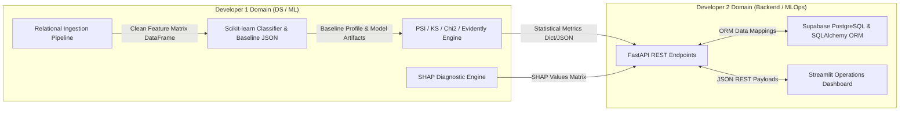

# Team Responsibility Matrix (RACI)

**Project Title:** An Automated MLOps Framework for Monitoring and Diagnosing Model Degradation in Production  
**Document Version:** 1.0.0  
**Status:** Approved / Draft  
**Target Audience:** Developer 1 (DS/ML Engineer), Developer 2 (Backend/MLOps Engineer), Project Manager  
**Date:** September 2026  

---

## 1. Role Definitions & Core Mandates

To ensure clear operational ownership and eliminate single points of ambiguity during project execution, responsibilities are partitioned between two specialized developer roles:

### 1.1 Developer 1: Data Science & Machine Learning Engineer
- **Primary Mandate:** Responsible for data pipeline intelligence, statistical algorithms, machine learning model baselining, drift detection metrics, and SHAP explainability routines.
- **Core Domain Ownership:** `src/ingestion/`, `src/ml_engine/`, `src/drift_engine/`, `src/explainability/`.

### 1.2 Developer 2: Backend & MLOps Engineer
- **Primary Mandate:** Responsible for software infrastructure, cloud database persistence, ORM data access layers, RESTful API services, interactive Streamlit operations dashboard, and CI/CD pipelines.
- **Core Domain Ownership:** `src/database/`, `src/api/`, `src/dashboard/`, `src/utils/`, `.github/`.

---

## 2. RACI Framework Definitions

The RACI model defines task engagement levels:
- **R - Responsible:** The developer who performs the activity and authors the code.
- **A - Accountable:** The developer with final approval and ownership for the deliverable quality.
- **C - Consulted:** The developer who provides essential input, parameters, or specifications needed for completion.
- **I - Informed:** The developer who is kept updated on progress or status changes.

---

## 3. Comprehensive Task Responsibility Matrix

| Task Category | Specific Deliverable / Activity | Dev 1 (DS/ML) | Dev 2 (Backend/MLOps) | Lead Architect |
| :--- | :--- | :---: | :---: | :---: |
| **Project Setup** | Repository Scaffolding & Virtual Environment | **C** | **R / A** | **I** |
| | `.gitignore`, `requirements.txt`, Environment Config | **C** | **R / A** | **I** |
| | GitHub Actions CI Workflow Setup (`ci.yml`) | **I** | **R / A** | **C** |
| **Data Ingestion** | Multi-Table RavenStack CSV Loader (`csv_loader.py`) | **R / A** | **C** | **I** |
| | Relational Key Join Engine (`relational_joiner.py`) | **R / A** | **C** | **C** |
| | Feature Aggregator & Sliding Windows (`feature_aggregator.py`) | **R / A** | **I** | **I** |
| | Data Schema Validator & Type Imputation (`schema_validator.py`) | **R / A** | **C** | **I** |
| **ML Engine** | Scikit-learn Model Training Script (`trainer.py`) | **R / A** | **I** | **C** |
| | Model Performance Evaluation (`evaluator.py`) | **R / A** | **I** | **I** |
| | Baseline Statistical Profile Generation (`baseline_builder.py`) | **R / A** | **C** | **C** |
| **Drift Engine** | Population Stability Index Engine (`psi_calculator.py`) | **R / A** | **I** | **C** |
| | Kolmogorov-Smirnov Test Module (`ks_tester.py`) | **R / A** | **I** | **I** |
| | Chi-Square Test Module (`chi_square_tester.py`) | **R / A** | **I** | **I** |
| | Evidently AI Data Drift Runner (`evidently_runner.py`) | **R / A** | **C** | **I** |
| **Explainability** | SHAP TreeExplainer Wrapper (`shap_explainer.py`) | **R / A** | **C** | **C** |
| | Root-Cause Drift Attribution (`root_cause_analyzer.py`) | **R / A** | **C** | **I** |
| **Database** | Supabase Cloud PostgreSQL Instance Provisioning | **I** | **R / A** | **C** |
| | SQLAlchemy ORM Models (`models.py`) | **C** | **R / A** | **C** |
| | Pydantic Request/Response Schemas (`schemas.py`) | **C** | **R / A** | **I** |
| | Database Repository Access Layer (`repository.py`) | **I** | **R / A** | **I** |
| **Backend API** | FastAPI Base Application (`app.py`) | **I** | **R / A** | **C** |
| | Monitoring & Batch Run Endpoints (`monitoring.py`) | **C** | **R / A** | **C** |
| | Drift Summary & Feature Metric Endpoints (`drift.py`) | **C** | **R / A** | **I** |
| | Explainability & SHAP Endpoints (`explainability.py`) | **C** | **R / A** | **I** |
| **Dashboard UI** | Streamlit Multi-Page Framework (`dashboard/app.py`) | **I** | **R / A** | **I** |
| | Interactive Plotly Drift Visualizations (`drift_charts.py`) | **C** | **R / A** | **I** |
| | SHAP Breakdown Visual Components (`shap_plots.py`) | **C** | **R / A** | **I** |
| | PDF/HTML Report Download Generator | **I** | **R / A** | **I** |
| **Integration** | End-to-End Pipeline Integration Testing | **R** | **R / A** | **C** |
| | Technical Documentation Suite (`docs/`) | **R** | **R** | **A** |

---

## 4. Subsystem Ownership & Hand-Off Interface Protocol

### 4.1 Interface Contract Rules Between Developers
1. **Data Transfer Contract (Dev 1 $\rightarrow$ Dev 2):** Dev 1 must return all statistical drift and SHAP outputs in strictly typed Python dictionaries conforming to agreed Pydantic models defined in `src/database/schemas.py`.
2. **Database Contract (Dev 2 $\rightarrow$ Dev 1):** Dev 2 provides high-level asynchronous repository functions (e.g., `save_batch_run_metrics(metrics: BatchRunCreate)`), encapsulating all raw SQL and connection pooling logic.
3. **API Contract (Dev 2 $\rightarrow$ Streamlit Dashboard):** All Streamlit UI pages communicate with backend capabilities solely via FastAPI REST calls, enforcing complete decoupling.

---

## 5. Document Approval & Sign-Off

- **Prepared By:** Senior MLOps Solution Architect & Project Manager  
- **Approved By Developer 1 (DS/ML):** Signed  
- **Approved By Developer 2 (Backend/MLOps):** Signed  
- **Status:** Approved & Implemented  

---
