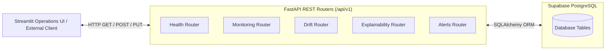
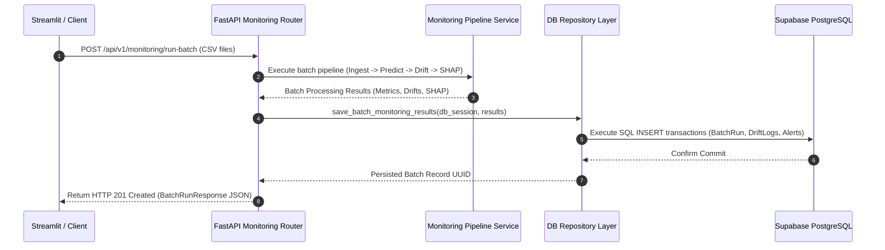

# API Design Document

**Project Title:** An Automated MLOps Framework for Monitoring and Diagnosing Model Degradation in Production  
**Document Version:** 1.0.0  
**Status:** Approved / Draft  
**Target Framework:** FastAPI (ASGI Python 3.10+)  
**Base URL:** `http://localhost:8000/api/v1`  
**Date:** September 2026  

---

## 1. Architectural Overview & Endpoint Summary

The FastAPI backend exposes a RESTful interface handling batch monitoring execution, historical metric queries, statistical drift breakdowns, SHAP diagnosis payloads, and drift alert management.



---

## 2. API Endpoint Specification Matrix

| Method | Endpoint Path | Description | Query / Path Parameters | Request Body | Status Code |
| :--- | :--- | :--- | :--- | :--- | :---: |
| **GET** | `/health` | Service health & Supabase connectivity status | None | None | `200 OK` |
| **POST** | `/monitoring/run-batch` | Triggers multi-table/batch drift & SHAP analysis | `model_version` (optional) | Multipart CSV files / JSON Batch | `201 Created` |
| **GET** | `/monitoring/batch/{batch_id}` | Retrieves execution details for a batch run | `batch_id` (UUID) | None | `200 OK` |
| **GET** | `/monitoring/history` | Returns paginated history of batch runs | `page`, `limit`, `drift_only` | None | `200 OK` |
| **GET** | `/drift/summary/{batch_id}` | Retrieves overall drift metrics for a batch | `batch_id` (UUID) | None | `200 OK` |
| **GET** | `/drift/features/{batch_id}` | Detailed feature-level statistical drift scores | `batch_id` (UUID), `status_filter` | None | `200 OK` |
| **GET** | `/explainability/shap-summary/{batch_id}` | Returns SHAP global feature attributions | `batch_id` (UUID), `top_n` | None | `200 OK` |
| **GET** | `/alerts/unresolved` | Lists all active unresolved drift alerts | `alert_level` (optional) | None | `200 OK` |
| **PUT** | `/alerts/{alert_id}/resolve` | Marks a drift alert as resolved | `alert_id` (UUID) | None | `200 OK` |

---

## 3. Detailed Endpoint Specs & Schemas

### 3.1 `POST /api/v1/monitoring/run-batch`
Executes complete batch evaluation: ingests relational CSV files, computes predictions, executes statistical drift suite (PSI, K-S, Chi-Square, Evidently), calculates SHAP values, and logs results to Supabase.

#### Request Headers
- `Content-Type: multipart/form-data`

#### Form Payload Parameters
- `accounts_file` (UploadFile, Required): Accounts table CSV.
- `subscriptions_file` (UploadFile, Required): Subscriptions table CSV.
- `usage_file` (UploadFile, Required): Feature usage table CSV.
- `tickets_file` (UploadFile, Required): Support tickets table CSV.
- `labels_file` (UploadFile, Optional): Ground-truth churn labels CSV (if evaluating post-deployment performance).

#### Successful Response (`201 Created`)
```json
{
  "status": "SUCCESS",
  "batch_id": "c39a82e4-1823-4d89-9a21-94f83b27ef31",
  "model_version": "v1.0.0",
  "run_timestamp": "2026-09-02T14:30:00Z",
  "record_count": 10500,
  "execution_time_sec": 4.82,
  "overall_psi_score": 0.285,
  "is_drift_detected": true,
  "drifted_features_count": 4,
  "total_features_evaluated": 18,
  "alerts_triggered": [
    {
      "alert_id": "8f3b12a9-7c42-4911-b021-98fe2a1100df",
      "alert_level": "CRITICAL",
      "alert_type": "FEATURE_DRIFT",
      "message": "Critical drift detected in feature 'resolution_time_hours' (PSI = 0.34, KS p-val = 0.001)."
    }
  ]
}
```

---

### 3.2 `GET /api/v1/drift/features/{batch_id}`
Returns per-feature statistical metrics comparing the batch against the baseline profile.

#### Query Parameters
- `status_filter` (string, optional): Filter by status (`NO_DRIFT`, `MODERATE_DRIFT`, `CRITICAL_DRIFT`).

#### Successful Response (`200 OK`)
```json
{
  "batch_id": "c39a82e4-1823-4d89-9a21-94f83b27ef31",
  "overall_psi_score": 0.285,
  "features": [
    {
      "feature_name": "avg_ticket_resolution_hours",
      "data_type": "continuous",
      "psi_score": 0.342,
      "ks_p_value": 0.0004,
      "chi_square_p_value": null,
      "drift_status": "CRITICAL_DRIFT",
      "baseline_mean": 12.4,
      "batch_mean": 28.7
    },
    {
      "feature_name": "monthly_recurring_revenue",
      "data_type": "continuous",
      "psi_score": 0.041,
      "ks_p_value": 0.6210,
      "chi_square_p_value": null,
      "drift_status": "NO_DRIFT",
      "baseline_mean": 250.0,
      "batch_mean": 248.5
    }
  ]
}
```

---

### 3.3 `GET /api/v1/explainability/shap-summary/{batch_id}`
Returns global feature importance rank shifts between the training baseline and the evaluated batch.

#### Query Parameters
- `top_n` (integer, default = 10): Limit to top $N$ impactful features.

#### Successful Response (`200 OK`)
```json
{
  "batch_id": "c39a82e4-1823-4d89-9a21-94f83b27ef31",
  "top_n": 5,
  "shap_attributions": [
    {
      "feature_name": "avg_ticket_resolution_hours",
      "baseline_mean_shap": 0.12,
      "batch_mean_shap": 0.48,
      "rank_shift": +4
    },
    {
      "feature_name": "daily_active_users",
      "baseline_mean_shap": 0.35,
      "batch_mean_shap": 0.31,
      "rank_shift": -1
    }
  ]
}
```

---

## 4. Pydantic Response Schemas (`src/database/schemas.py`)

```python
from pydantic import BaseModel, Field
from typing import List, Optional
from datetime import datetime
import uuid

class AlertResponse(BaseModel):
    alert_id: uuid.UUID
    alert_level: str
    alert_type: str
    message: str
    is_resolved: bool
    created_at: datetime

    class Config:
        from_attributes = True

class FeatureDriftResponse(BaseModel):
    feature_name: str
    data_type: str
    psi_score: float
    ks_p_value: Optional[float] = None
    chi_square_p_value: Optional[float] = None
    drift_status: str
    baseline_mean: Optional[float] = None
    batch_mean: Optional[float] = None

    class Config:
        from_attributes = True

class BatchRunResponse(BaseModel):
    batch_id: uuid.UUID
    model_id: uuid.UUID
    run_timestamp: datetime
    record_count: int
    execution_time_sec: float
    is_drift_detected: bool
    overall_psi_score: float
    status: str
    alerts_triggered: List[AlertResponse] = []

    class Config:
        from_attributes = True
```

---

## 5. Error Handling & Standard HTTP Status Codes

| HTTP Code | Error Condition | Standard JSON Error Payload Example |
| :---: | :--- | :--- |
| **`400 Bad Request`** | Invalid file format (non-CSV uploaded) | `{"detail": "Uploaded file must be a CSV format."}` |
| **`404 Not Found`** | Batch ID does not exist in Supabase | `{"detail": "Batch run 'c39a...' not found."}` |
| **`422 Unprocessable`** | Missing required primary key in CSV | `{"detail": "Relational merge failed: missing column 'account_id'."}` |
| **`500 Server Error`** | Unhandled internal exception or DB fail | `{"detail": "Internal processing error: Supabase connection timeout."}` |

---

## 6. API Sequence Diagram (Batch Processing Flow)



---

## 7. Document Approval & Sign-Off

- **Prepared By:** Lead Backend & API Engineer (Developer 2)  
- **Reviewed By:** Senior Software Architect & Developer 1  
- **Status:** Approved for Implementation  

---
