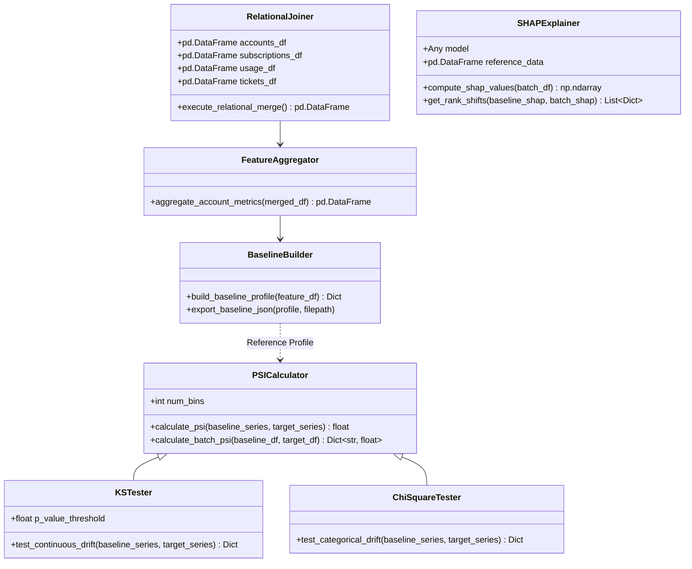

# Module Design Document

**Project Title:** An Automated MLOps Framework for Monitoring and Diagnosing Model Degradation in Production  
**Document Version:** 1.0.0  
**Status:** Approved / Draft  
**Target Audience:** Senior Software Engineers, Data Scientists, MLOps Developers  
**Date:** September 2026  

---

## 1. Architectural Overview & Component Scope

This document specifies the internal class structures, function signatures, data types, and core mathematical algorithms for the modular Python packages located under `src/`.



---

## 2. Ingestion Subsystem (`src/ingestion/`)

### 2.1 `RelationalJoiner` (`src/ingestion/relational_joiner.py`)
Responsible for ingesting raw RavenStack multi-table CSVs and performing deterministic foreign key joins on `account_id`.

```python
import pandas as pd
from typing import Dict

class RelationalJoiner:
    """Ingests multi-table RavenStack CSV DataFrames and executes relational merges."""
    
    def __init__(self, tables: Dict[str, pd.DataFrame]):
        self.accounts_df = tables["accounts"]
        self.subscriptions_df = tables["subscriptions"]
        self.usage_df = tables["usage"]
        self.tickets_df = tables["tickets"]
        self.labels_df = tables.get("labels")

    def execute_relational_merge(self) -> pd.DataFrame:
        """
        Merges multi-table data on 'account_id' using left outer joins to preserve accounts.
        Returns aggregated raw merged DataFrame.
        """
        pass
```

### 2.2 `FeatureAggregator` (`src/ingestion/feature_aggregator.py`)
Transforms raw event logs into single-row-per-account features.

```python
import pandas as pd

class FeatureAggregator:
    @staticmethod
    def aggregate_account_metrics(merged_df: pd.DataFrame) -> pd.DataFrame:
        """
        Aggregates:
        - Total sessions, API call counts from usage_df
        - Mean ticket resolution time, total support tickets, average CSAT score
        - MRR, billing frequency encoding, contract duration from subscriptions_df
        Returns cleaned feature matrix indexed by account_id.
        """
        pass
```

---

## 3. Machine Learning Engine (`src/ml_engine/`)

### 3.1 `BaselineBuilder` (`src/ml_engine/baseline_builder.py`)
Generates baseline reference statistical profile during training.

```python
import pandas as pd
from typing import Dict, Any

class BaselineBuilder:
    def __init__(self, feature_df: pd.DataFrame, categorical_cols: list, numerical_cols: list):
        self.feature_df = feature_df
        self.categorical_cols = categorical_cols
        self.numerical_cols = numerical_cols

    def build_baseline_profile((self) -> Dict[str, Any]:
        """
        Computes statistical reference profile:
        - Continuous: mean, std, quantiles (10%, 25%, 50%, 75%, 90%), bin edges.
        - Categorical: value frequency ratios.
        Returns serializable dictionary.
        """
        pass
```

---

## 4. Drift Engine Subsystem (`src/drift_engine/`)

### 4.1 `PSICalculator` (`src/drift_engine/psi_calculator.py`)
Calculates Population Stability Index for continuous numerical features.

#### Mathematical Algorithm & Pseudocode
The PSI metric measures shift between Baseline distribution ($E$) and Production Target distribution ($A$):

$$\text{PSI} = \sum_{i=1}^{B} \left( A_i - E_i \right) \times \ln\left( \frac{A_i}{E_i} \right)$$

```python
import numpy as np
import pandas as pd
from typing import Dict

class PSICalculator:
    def __init__(self, num_bins: int = 10):
        self.num_bins = num_bins

    def calculate_psi(self, baseline_series: pd.Series, target_series: pd.Series) -> float:
        """
        1. Create equal-frequency bin edges based on baseline_series quantiles.
        2. Compute proportion of records falling into each bin for baseline (E) and target (A).
        3. Replace 0 proportions with 1e-4 to avoid division by zero.
        4. Sum (A_i - E_i) * ln(A_i / E_i) over all bins.
        """
        quantiles = np.linspace(0, 1, self.num_bins + 1)
        bin_edges = np.quantile(baseline_series.dropna(), quantiles)
        bin_edges[0] -= 1e-5
        bin_edges[-1] += 1e-5

        expected_counts, _ = np.histogram(baseline_series.dropna(), bins=bin_edges)
        actual_counts, _ = np.histogram(target_series.dropna(), bins=bin_edges)

        expected_pct = np.where(expected_counts == 0, 1e-4, expected_counts) / len(baseline_series)
        actual_pct = np.where(actual_counts == 0, 1e-4, actual_counts) / len(target_series)

        psi_val = np.sum((actual_pct - expected_pct) * np.log(actual_pct / expected_pct))
        return float(psi_val)
```

### 4.2 `KSTester` (`src/drift_engine/ks_tester.py`)
Performs two-sample Kolmogorov-Smirnov non-parametric statistical test.

```python
from scipy.stats import ks_2samp
import pandas as pd
from typing import Dict

class KSTester:
    @staticmethod
    def test_continuous_drift(baseline_series: pd.Series, target_series: pd.Series) -> Dict[str, float]:
        """
        Runs scipy.stats.ks_2samp.
        Returns dict containing:
        - statistic: KS test distance statistic
        - p_value: p-value (p < 0.05 indicates significant drift)
        """
        stat, p_val = ks_2samp(baseline_series.dropna(), target_series.dropna())
        return {"ks_statistic": float(stat), "p_value": float(p_val)}
```

### 4.3 `ChiSquareTester` (`src/drift_engine/chi_square_tester.py`)
Performs Chi-Square test of independence for categorical distributions.

```python
from scipy.stats import chisquare
import pandas as pd
from typing import Dict

class ChiSquareTester:
    @staticmethod
    def test_categorical_drift(baseline_series: pd.Series, target_series: pd.Series) -> Dict[str, float]:
        """
        Aligns category frequencies across baseline and target.
        Runs scipy.stats.chisquare on aligned frequency arrays.
        Returns dict containing chi2_statistic and p_value.
        """
        pass
```

---

## 5. Explainability Subsystem (`src/explainability/`)

### 5.1 `SHAPExplainer` (`src/explainability/shap_explainer.py`)
Wrapper around `shap.TreeExplainer` calculating global and local feature attributions.

```python
import shap
import pandas as pd
import numpy as np
from typing import Dict, List, Any

class SHAPExplainer:
    def __init__(self, trained_model: Any):
        self.explainer = shap.TreeExplainer(trained_model)

    def compute_mean_abs_shap(self, feature_df: pd.DataFrame) -> Dict[str, float]:
        """
        Computes SHAP values matrix for batch feature_df.
        Calculates mean absolute SHAP value for each feature column:
        mean_abs_shap_j = mean(|SHAP_ij|) across all instances i.
        Returns dict mapping feature_name -> mean_abs_shap.
        """
        shap_values = self.explainer.shap_values(feature_df)
        if isinstance(shap_values, list): # Multi-class/binary list output
            shap_values = shap_values[1]
        
        mean_abs = np.mean(np.abs(shap_values), axis=0)
        return dict(zip(feature_df.columns, mean_abs.tolist()))
```

---

## 6. Database Repository Layer (`src/database/repository.py`)

Encapsulates all SQLAlchemy ORM database queries for FastAPI endpoints.

```python
from sqlalchemy.orm import Session
from src.database import models, schemas
import uuid
from typing import List, Optional

class MonitoringRepository:
    @staticmethod
    def create_batch_run(db: Session, batch_data: schemas.BatchRunCreate) -> models.BatchRun:
        """Persists BatchRun record along with child FeatureDriftLog and AlertLog entries."""
        db_batch = models.BatchRun(**batch_data.dict(exclude={"feature_drifts", "alerts"}))
        db.add(db_batch)
        db.commit()
        db.refresh(db_batch)

        for drift_item in batch_data.feature_drifts:
            db_drift = models.FeatureDriftLog(**drift_item.dict(), batch_id=db_batch.batch_id)
            db.add(db_drift)
            
        for alert_item in batch_data.alerts:
            db_alert = models.AlertLog(**alert_item.dict(), batch_id=db_batch.batch_id)
            db.add(db_alert)

        db.commit()
        return db_batch
```

---

## 7. Document Approval & Sign-Off

- **Prepared By:** Senior Technical Lead & MLOps Architect  
- **Reviewed By:** Developer 1 (Data Science) & Developer 2 (Backend)  
- **Status:** Approved for Code Implementation  

---
