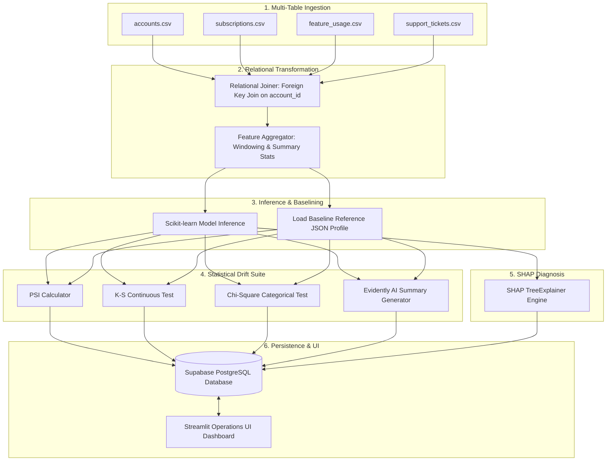
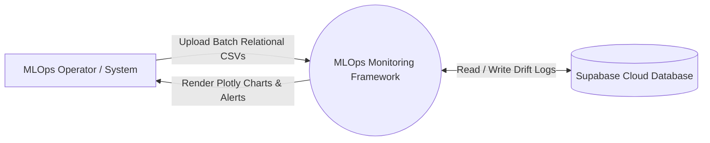
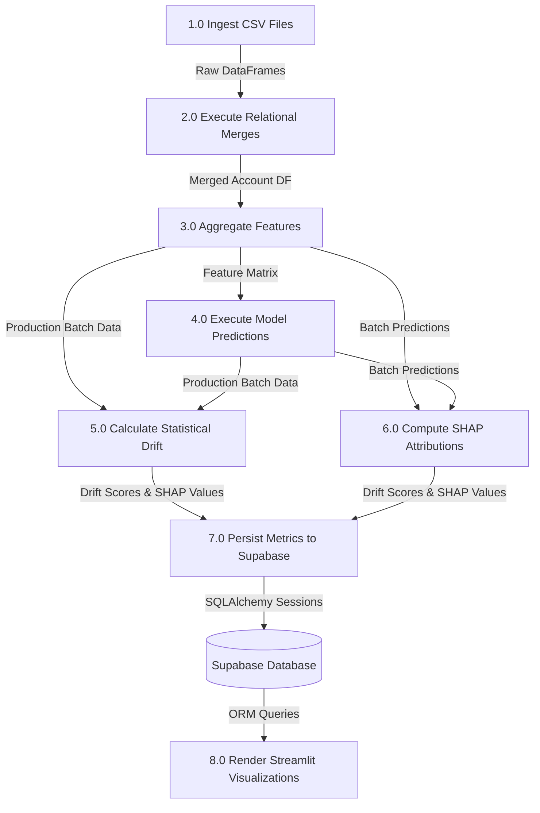
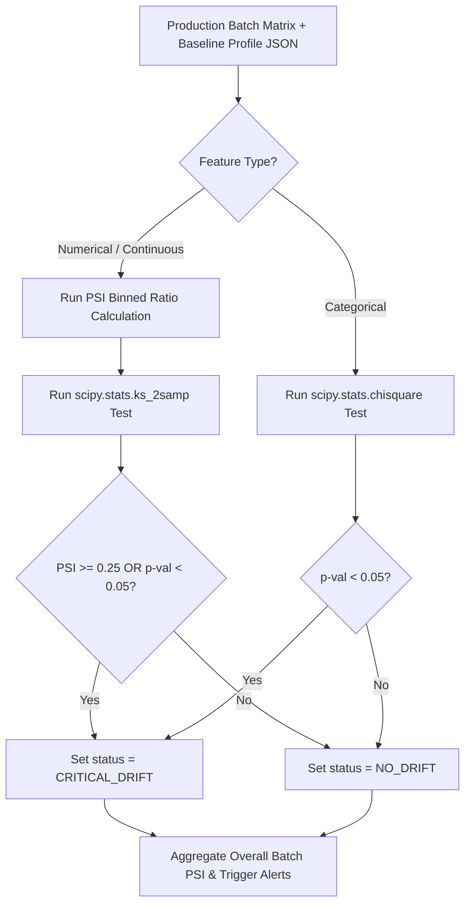

# Data Flow Document

**Project Title:** An Automated MLOps Framework for Monitoring and Diagnosing Model Degradation in Production  
**Document Version:** 1.0.0  
**Status:** Approved / Draft  
**Target Audience:** Data Engineers, ML Engineers, Backend Developers, System Architects  
**Date:** September 2026  

---

## 1. Architectural Overview & Data Lifecycle

The framework ingests normalized multi-table CSV files representing SaaS customer entities, transforms them into single-row-per-account feature vectors, evaluates model predictions, computes statistical distribution shifts against an offline baseline profile, calculates SHAP feature attributions, and persists all diagnostic logs into Supabase PostgreSQL.

---

## 2. Data Flow Diagrams (DFD)

### 2.1 DFD Level 0: High-Level Context Diagram

### 2.2 DFD Level 1: Detailed System Processing Flow

---

## 3. Data Transformation & Schema Lineage

Below is the field-level data lineage table tracking how raw multi-table RavenStack CSV columns transform into model features, statistical metrics, and database log columns.

| Raw Source Table | Raw Input Column | Transformation / Aggregation Rule | Target Feature Name | Feature Type | Target Database Column |
| :--- | :--- | :--- | :--- | :--- | :--- |
| `accounts` | `company_size` | Categorical encoding (Small, Mid, Enterprise) | `company_size_code` | Categorical | `feature_drift_logs.feature_name` |
| `accounts` | `signup_date` | Days since signup = $\text{Today} - \text{signup\_date}$ | `account_tenure_days` | Numerical | `feature_drift_logs.feature_name` |
| `subscriptions` | `monthly_recurring_revenue` | Direct floating-point extraction | `mrr` | Continuous | `feature_drift_logs.feature_name` |
| `subscriptions` | `billing_frequency` | One-hot / Label encoding (Monthly, Annual) | `is_annual_billing` | Categorical | `feature_drift_logs.feature_name` |
| `feature_usage` | `api_call_count` | Sum over last 30 days per `account_id` | `total_api_calls_30d` | Continuous | `feature_drift_logs.feature_name` |
| `feature_usage` | `daily_active_users` | Mean DAU per `account_id` over 30 days | `mean_dau_30d` | Continuous | `feature_drift_logs.feature_name` |
| `support_tickets` | `resolution_time_hours` | Mean resolution hours per `account_id` | `avg_ticket_resolution_hours` | Continuous | `feature_drift_logs.feature_name` |
| `support_tickets` | `ticket_id` | Count of tickets per `account_id` | `total_support_tickets` | Continuous | `feature_drift_logs.feature_name` |
| `churn_labels` | `is_churned` | Target ground truth label ($0$ or $1$) | `is_churned` | Binary Target | `model_performance_logs.f1_score` |

---

## 4. Statistical Drift Computation Flow

---

## 5. Data Quality & Error Guardrails

To prevent pipeline crashes during automated batch runs, data validation guardrails are enforced at each transition stage:

1. **Primary Key Alignment Guardrail:** If an `account_id` in `subscriptions` or `feature_usage` does not exist in `accounts`, the row is isolated in an orphan queue and logged without halting the join.
2. **Missing Value Imputation:**
   - Numerical feature missing values (e.g., accounts with zero support tickets) are imputed with explicit zero values (`0.0`).
   - Categorical missing values are filled with `'UNKNOWN'`.
3. **Zero Variance Guardrail:** If a continuous feature in a production batch has zero variance ($\sigma = 0$), K-S testing is skipped, and a default non-drift warning flag is recorded to prevent division-by-zero runtime exceptions.
4. **Minimum Batch Sample Size Enforcement:** A minimum threshold of $N \ge 100$ records is required before executing K-S and Chi-Square statistical tests to avoid sample size bias false positives.

---

## 6. Document Approval & Sign-Off

- **Prepared By:** Senior Data Engineer & MLOps Architect  
- **Reviewed By:** Lead Data Scientist & Backend Lead  
- **Status:** Approved for Pipeline Implementation  

---
