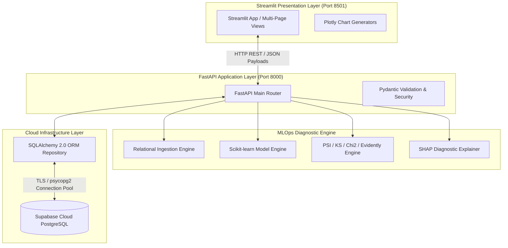
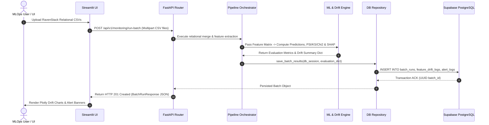

# System Integration Document

**Project Title:** An Automated MLOps Framework for Monitoring and Diagnosing Model Degradation in Production  
**Document Version:** 1.0.0  
**Status:** Approved / Draft  
**Target Audience:** Software Integration Engineers, Backend Developers, MLOps Leads  
**Date:** September 2026  

---

## 1. Executive Summary & Integration Architecture

The **System Integration Document** details how individual Python subsystems (`ingestion`, `ml_engine`, `drift_engine`, `explainability`, `database`, `api`, and `dashboard`) interface with one another and external services (Supabase Cloud PostgreSQL). 



---

## 2. Subsystem Interface & Integration Touchpoint Specifications

### 2.1 Touchpoint 1: Ingestion Engine $\rightarrow$ ML Model Engine
- **Interface Mechanism:** In-memory Python function call.
- **Data Payload:** Cleaned single-row-per-account Pandas `DataFrame` containing feature matrix.
- **Contract Guarantee:** Feature columns in `DataFrame` must match exact order and names expected by `churn_model.pkl` (`model.feature_names_in_`).
- **Validation:** Enforced via `src/ingestion/schema_validator.py`.

### 2.2 Touchpoint 2: ML Engine $\rightarrow$ Drift & SHAP Engines
- **Interface Mechanism:** In-memory Python data passing.
- **Data Payload:** Baseline reference distribution dictionary (`baseline_reference.json`) and production batch `DataFrame` + prediction probabilities.
- **Contract Guarantee:** Baseline feature keys must match 100% of production feature column names.

### 2.3 Touchpoint 3: MLOps Core Engines $\rightarrow$ FastAPI Router Layer
- **Interface Mechanism:** Service layer invocation within FastAPI async endpoint handlers (`src/api/routers/monitoring.py`).
- **Data Payload:** Dictionary outputs converted into strongly typed Pydantic schemas (`BatchRunResponse`, `FeatureDriftResponse`).
- **Validation:** FastAPI Pydantic parsing layer auto-validates types and returns `422 Unprocessable Entity` on mismatch.

### 2.4 Touchpoint 4: FastAPI Routers $\rightarrow$ Supabase Database
- **Interface Mechanism:** SQLAlchemy 2.0 ORM session (`get_db` dependency injection).
- **Data Payload:** Declarative ORM Model instances (`BatchRun`, `FeatureDriftLog`, `AlertLog`).
- **Contract Guarantee:** Transaction integrity via `db.commit()` and `db.rollback()` context managers.

### 2.5 Touchpoint 5: Streamlit Dashboard $\rightarrow$ FastAPI Backend REST API
- **Interface Mechanism:** Asynchronous/synchronous HTTP requests using `requests` / `httpx`.
- **Data Payload:** Standard JSON payloads over HTTP `http://localhost:8000/api/v1`.
- **Decoupling Guarantee:** Streamlit contains zero raw SQL or direct ML engine dependencies; all operations route through FastAPI REST endpoints.

---

## 3. End-to-End Integration Sequence



---

## 4. System Recovery & Exception Handling Protocols

| Failure Scenario | Catching Layer | System Behavior / Recovery Action |
| :--- | :--- | :--- |
| **Missing Foreign Key in CSV** | `src/ingestion/` | Log warning, execute outer join with zero-imputation; do not crash pipeline. |
| **Missing Feature Column** | `schema_validator.py` | Throw `SchemaValidationError`; FastAPI catches and returns `HTTP 422` with missing column list. |
| **Supabase DB Timeout** | `src/database/` | SQLAlchemy retries up to 3 times (`pool_pre_ping=True`). If persistent, rollback transaction and return `HTTP 500`. |
| **SHAP Explainer Memory Spike** | `src/explainability/` | Automatically sample down batch size to max 500 rows for background baseline values to limit RAM usage under 1GB. |
| **FastAPI Backend Offline** | `src/dashboard/` | Streamlit displays fallback alert banner: *"Backend REST API unreachable at localhost:8000. Please start run_api.py."* |

---

## 5. Integration Verification Suite (`tests/integration/`)

The integration between components is validated using automated Pytest scripts:

### 5.1 End-to-End Integration Test (`tests/integration/test_end_to_end_pipeline.py`)
```python
import pytest
from fastapi.testclient import TestClient
from src.api.app import app

client = TestClient(app)

def test_full_monitoring_batch_integration():
    """Verifies end-to-end flow from multipart CSV upload to Supabase logging and JSON response."""
    files = {
        "accounts_file": ("accounts.csv", open("data/raw/accounts.csv", "rb"), "text/csv"),
        "subscriptions_file": ("subscriptions.csv", open("data/raw/subscriptions.csv", "rb"), "text/csv"),
        "usage_file": ("feature_usage.csv", open("data/raw/feature_usage.csv", "rb"), "text/csv"),
        "tickets_file": ("support_tickets.csv", open("data/raw/support_tickets.csv", "rb"), "text/csv"),
    }
    
    response = client.post("/api/v1/monitoring/run-batch", files=files)
    
    assert response.status_code == 201
    data = response.json()
    assert "batch_id" in data
    assert data["status"] == "SUCCESS"
    assert isinstance(data["overall_psi_score"], float)
    assert isinstance(data["alerts_triggered"], list)
```

---

## 6. Document Approval & Sign-Off

- **Prepared By:** Senior Integration Engineer & Solutions Architect  
- **Reviewed By:** Lead Data Scientist & Backend Engineer  
- **Status:** Approved for Integration Phase  

---
