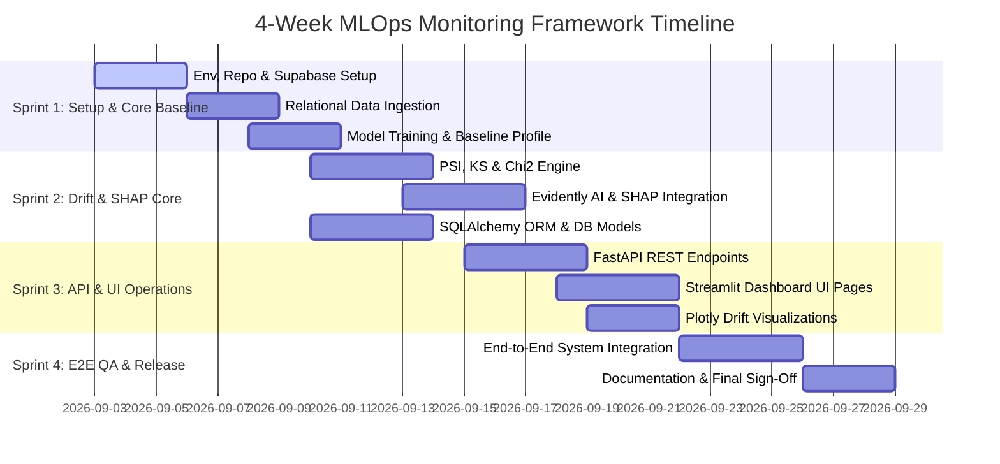
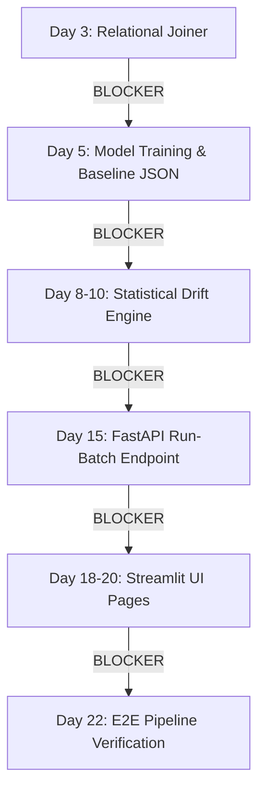

# Project Timeline & Execution Schedule

**Project Title:** An Automated MLOps Framework for Monitoring and Diagnosing Model Degradation in Production  
**Document Version:** 1.0.0  
**Status:** Approved / Draft  
**Project Duration:** 4 Weeks (28 Calendar Days)  
**Target Delivery Date:** Late September 2026  
**Date:** September 2026  

---

## 1. Executive Summary & Timeline Strategy

The project execution is organized into **4 weekly sprints** across 28 calendar days. This schedule coordinates parallel execution paths between **Developer 1 (Data Science & ML)** and **Developer 2 (Backend & MLOps)** while defining strict critical path milestones.

---

## 2. Sprint-by-Sprint Breakdown

### 2.1 Sprint 1: Project Setup, Relational Ingestion & Baseline Model (Days 1 – 7)
- **Primary Goal:** Establish environment scaffolding, provision Supabase database, build relational ingestion engine, train initial binary classifier, and export baseline JSON profile.

| Day | Developer 1 (DS/ML Engine) | Developer 2 (Backend/MLOps) | Joint Milestone |
| :---: | :--- | :--- | :--- |
| **Day 1** | Setup local Python 3.10 environment, install dependencies. | Provision Supabase PostgreSQL instance, set `.env.example`. | Repo scaffolded, CI active. |
| **Day 2** | Inspect RavenStack CSV schemas (`accounts`, `subscriptions`). | Setup FastAPI & Streamlit base skeletons (`run_api.py`). | Directory layout validated. |
| **Day 3** | Implement `RelationalJoiner` (`relational_joiner.py`). | Write initial database connection module (`connection.py`). | Subsystems connected. |
| **Day 4** | Build `FeatureAggregator` (`feature_aggregator.py`). | Create Pydantic schemas (`schemas.py`). | Feature matrix verified. |
| **Day 5** | Train Scikit-learn binary classifier (`trainer.py`). | Define PostgreSQL DDL scripts & SQLAlchemy Base (`models.py`). | DB schema deployed. |
| **Day 6** | Compute evaluation metrics (F1, ROC-AUC, Confusion Matrix). | Test SQLAlchemy connection pool & table creation. | Model baseline trained. |
| **Day 7** | Build `BaselineBuilder` & export `baseline_reference.json`. | Implement database repository functions (`repository.py`). | **Milestone 1 Achieved.** |

---

### 2.2 Sprint 2: Statistical Drift Engine & SHAP Diagnostic Core (Days 8 – 14)
- **Primary Goal:** Implement statistical drift suite (PSI, K-S test, Chi-Square test, Evidently AI) and SHAP feature attribution diagnosis.

| Day | Developer 1 (DS/ML Engine) | Developer 2 (Backend/MLOps) | Joint Milestone |
| :---: | :--- | :--- | :--- |
| **Day 8** | Implement `PSICalculator` (`psi_calculator.py`). | Build SQLAlchemy models for `BatchRun` & `FeatureDriftLog`. | Core ORM mapped. |
| **Day 9** | Implement `KSTester` & `ChiSquareTester`. | Build SQLAlchemy models for `ShapImportanceLog` & `AlertLog`. | Statistical tests complete. |
| **Day 10** | Validate statistical drift algorithms on synthetic drifted data. | Create unit test fixtures in `tests/unit/test_database.py`. | DB CRUD verified. |
| **Day 11** | Integrate Evidently AI runner (`evidently_runner.py`). | Implement FastAPI router skeleton (`routers/monitoring.py`). | Evidently runner active. |
| **Day 12** | Implement `SHAPExplainer` (`shap_explainer.py`). | Implement FastAPI router (`routers/drift.py`). | SHAP attribution active. |
| **Day 13** | Implement `RootCauseAnalyzer` (rank shift logic). | Implement FastAPI router (`routers/explainability.py`). | Diagnostic engine complete. |
| **Day 14** | Execute unit tests for drift & SHAP subsystems. | Execute API router unit tests using FastAPI `TestClient`. | **Milestone 2 Achieved.** |

---

### 2.3 Sprint 3: REST API Services & Streamlit Operations UI (Days 15 – 21)
- **Primary Goal:** Connect MLOps diagnostic engines to FastAPI endpoints and build interactive Streamlit operations dashboard.

| Day | Developer 1 (DS/ML Engine) | Developer 2 (Backend/MLOps) | Joint Milestone |
| :---: | :--- | :--- | :--- |
| **Day 15** | Assist Dev 2 in wiring statistical engines into FastAPI services. | Finalize `POST /api/v1/monitoring/run-batch` endpoint. | Batch endpoint active. |
| **Day 16** | Validate JSON payload accuracy for feature drift endpoints. | Build Streamlit multi-page navigation layout (`app.py`). | UI navigation live. |
| **Day 17** | Implement Plotly continuous feature distribution overlay builder. | Build `Overview.py` page (KPI cards, active alert banners). | Overview UI active. |
| **Day 18** | Implement Plotly PSI score breakdown chart builder. | Build `Drift_Analysis.py` page (per-feature drill-downs). | Drift UI active. |
| **Day 19** | Implement Plotly SHAP rank shift waterfall chart builder. | Build `SHAP_Diagnosis.py` page (root-cause breakdown). | SHAP UI active. |
| **Day 20** | Verify mathematical interpretation of dashboard charts. | Build `Historical_Logs.py` page (Supabase query filters). | Log filtering live. |
| **Day 21** | Execute component-level integration testing. | Implement PDF/HTML report download generator. | **Milestone 3 Achieved.** |

---

### 2.4 Sprint 4: System Integration, End-to-End QA & Release (Days 22 – 28)
- **Primary Goal:** Execute full end-to-end integration testing, optimize performance, finalize documentation, and present project sign-off.

| Day | Developer 1 (DS/ML Engine) | Developer 2 (Backend/MLOps) | Joint Milestone |
| :---: | :--- | :--- | :--- |
| **Day 22** | Execute E2E pipeline test (`test_end_to_end_pipeline.py`). | Validate Supabase connection resilience under load. | E2E test executing. |
| **Day 23** | Debug edge cases (missing CSV columns, small sample sizes). | Fix API exception handling & HTTP 422 error payloads. | Edge cases handled. |
| **Day 24** | Optimize SHAP computation speed using background sampling. | Optimize Streamlit caching (`@st.cache_data`). | Performance tuned. |
| **Day 25** | Finalize ML & Drift engine technical documentation in `docs/`. | Finalize API, DB, and UI documentation in `docs/`. | Documentation complete. |
| **Day 26** | Perform clean repository audit and check CI workflows. | Audit `.env.example` and security configurations. | Repository clean. |
| **Day 27** | Prepare presentation demonstration & user walkthrough. | Prepare final release package & tag `v1.0.0`. | Release candidate ready. |
| **Day 28** | Final Project Sign-off & Presentation. | Final Project Sign-off & Presentation. | **Project Completed.** |

---

## 3. Critical Path & Bottleneck Analysis

- **Critical Path Dependency 1 (Relational Joiner):** Model baseline generation and feature drift computation cannot commence until `relational_joiner.py` cleanly merges RavenStack CSV tables.
- **Critical Path Dependency 2 (Baseline JSON Profile):** The statistical drift engine requires `baseline_reference.json` as its statistical anchor.
- **Critical Path Dependency 3 (FastAPI Monitoring Endpoint):** Streamlit UI development depends on functioning REST endpoints for data rendering.

---

## 4. Document Approval & Sign-Off

- **Prepared By:** Senior Project Manager & Technical Lead  
- **Approved By Developer 1 (Data Science):** Signed  
- **Approved By Developer 2 (Backend/MLOps):** Signed  
- **Status:** Approved for Project Execution  

---
