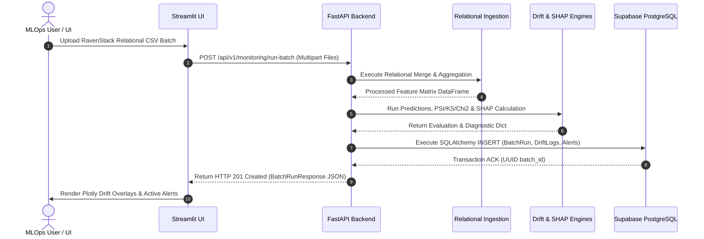

# Software Design Document (SDD)

**Project Title:** An Automated MLOps Framework for Monitoring and Diagnosing Model Degradation in Production  
**Document Version:** 1.0.0  
**Status:** Approved / Draft  
**Target Audience:** Software Architects, Lead Developers, System Engineers, Technical Reviewers  
**Date:** September 2026  

---

## 1. System Overview & Purpose

This **Software Design Document (SDD)** serves as the comprehensive technical specification for the **Automated MLOps Monitoring and Diagnostic Framework**. The system evaluates post-deployment performance decay in a SaaS Customer Churn binary classification model trained on the relational **RavenStack Synthetic SaaS Dataset**.

### 1.1 Core Mission
The system automates the detection of **Data Drift** (input feature distribution shifts) and **Concept Drift** (target relationship decay), diagnoses root-cause degradation using **SHAP**, logs diagnostic records into **Supabase Cloud PostgreSQL** via **SQLAlchemy 2.0**, and presents operational metrics through an interactive **Streamlit** dashboard powered by **FastAPI** backend services.

---

## 2. System Architecture & Component Hierarchy

The system adopts a **Modular Monolith** architecture partitioned into five logical tiers:

```mermaid
graph TD
    subgraph Tier1["1. Presentation Tier"]
        UI[Streamlit Operations UI (Port 8501)]
        Plotly[Plotly Chart Component Builders]
    end

    subgraph Tier2["2. Application Service Tier"]
        API[FastAPI ASGI Application (Port 8000)]
        Router[REST Routers & Pydantic Validation]
    end

    subgraph Tier3["3. MLOps Diagnostic Core Tier"]
        Ingest[Relational Ingestion & Aggregator]
        ML[Scikit-learn Model Predictor]
        Drift[Statistical Drift Engine (PSI, KS, Chi2)]
        SHAP[SHAP TreeExplainer Engine]
    end

    subgraph Tier4["4. Persistence & ORM Tier"]
        ORM[SQLAlchemy 2.0 ORM Repository]
        Driver[psycopg2 Connection Pool]
    end

    subgraph Tier5["5. Cloud Infrastructure Tier"]
        Supabase[(Supabase Cloud PostgreSQL Database)]
    end

    UI <-->|HTTP REST / JSON| API
    API --> Router
    Router --> Ingest & ML & Drift & SHAP
    Router <--> ORM
    ORM --> Driver
    Driver <-->|TLS Encrypted SQL| Supabase
```

---

## 3. Subsystem Specifications

### 3.1 Relational Ingestion Engine (`src/ingestion/`)
- **Input:** Multi-table RavenStack CSV datasets (`accounts`, `subscriptions`, `feature_usage`, `support_tickets`, `churn_labels`).
- **Processing Logic:** Performs left outer joins on `account_id` and aggregates event logs into a single feature row per account (e.g., mean DAU, total API calls, average ticket resolution hours).
- **Output:** Cleaned Pandas `DataFrame` conforming to expected model schema.

### 3.2 Machine Learning & Baselining Engine (`src/ml_engine/`)
- **Classifier:** Scikit-learn binary classification model (Random Forest / XGBoost).
- **Baseline Generator:** During offline training, extracts reference feature means, standard deviations, quantile bin edges, and categorical frequency arrays saved to `data/baseline/baseline_reference.json`.

### 3.3 Statistical Drift Detection Subsystem (`src/drift_engine/`)
- **PSI Calculator:** Computes Population Stability Index ($PSI \ge 0.25$ triggers CRITICAL_DRIFT).
- **K-S Tester:** Executes continuous two-sample Kolmogorov-Smirnov non-parametric tests ($p < 0.05$).
- **Chi-Square Tester:** Executes categorical frequency independence tests ($p < 0.05$).
- **Evidently AI Runner:** Generates standalone Evidently HTML/JSON Data Drift reports.

### 3.4 Explainability Engine (`src/explainability/`)
- **SHAP Explainer:** Utilizes `shap.TreeExplainer` to compute mean absolute SHAP values ($\text{mean}(|\text{SHAP}|)$) across production batches and computes feature importance rank shifts.

### 3.5 Database & ORM Layer (`src/database/`)
- **Database:** Supabase Cloud PostgreSQL 15+.
- **ORM:** SQLAlchemy 2.0 mapping declarative models (`ModelVersion`, `BatchRun`, `FeatureDriftLog`, `ModelPerformanceLog`, `ShapImportanceLog`, `AlertLog`).
- **Connection Pool:** `pool_size=10`, `max_overflow=20`, `pool_pre_ping=True`.

### 3.6 REST API Backend (`src/api/`)
- **Framework:** FastAPI with Uvicorn ASGI server.
- **Endpoints:** `POST /api/v1/monitoring/run-batch`, `GET /api/v1/drift/features/{batch_id}`, `GET /api/v1/explainability/shap-summary/{batch_id}`, `GET /api/v1/alerts/unresolved`.

### 3.7 Operations Dashboard UI (`src/dashboard/`)
- **Framework:** Streamlit multi-page web application.
- **Pages:** Overview, Drift Analysis, SHAP Diagnosis, Historical Logs.

---

## 4. Database ER Diagram

```mermaid
erdiagram
    MODEL_VERSIONS ||--o{ BATCH_RUNS : "evaluates"
    BATCH_RUNS ||--o{ FEATURE_DRIFT_LOGS : "contains"
    BATCH_RUNS ||--o{ MODEL_PERFORMANCE_LOGS : "records"
    BATCH_RUNS ||--o{ SHAP_IMPORTANCE_LOGS : "diagnoses"
    BATCH_RUNS ||--o{ ALERT_LOGS : "triggers"

    MODEL_VERSIONS {
        uuid model_id PK
        string version_name
        string algorithm_name
        timestamp trained_at
        jsonb training_metrics
        string baseline_json_path
    }

    BATCH_RUNS {
        uuid batch_id PK
        uuid model_id FK
        timestamp run_timestamp
        int record_count
        float execution_time_sec
        boolean is_drift_detected
        float overall_psi_score
    }

    FEATURE_DRIFT_LOGS {
        uuid log_id PK
        uuid batch_id FK
        string feature_name
        string data_type
        float psi_score
        float ks_p_value
        float chi_square_p_value
        string drift_status
    }

    MODEL_PERFORMANCE_LOGS {
        uuid perf_id PK
        uuid batch_id FK
        float f1_score
        float roc_auc
        jsonb confusion_matrix
    }

    SHAP_IMPORTANCE_LOGS {
        uuid shap_id PK
        uuid batch_id FK
        string feature_name
        float baseline_mean_shap
        float batch_mean_shap
        int rank_shift
    }

    ALERT_LOGS {
        uuid alert_id PK
        uuid batch_id FK
        string alert_level
        string alert_type
        text message
        boolean is_resolved
    }
```

---

## 5. End-to-End System Processing Sequence



---

## 6. Non-Functional Requirements & Guardrails

### 6.1 Performance & Throughput
- **Batch Processing Latency:** Process 10,000 multi-table records (ingest, predict, compute drift, run SHAP) in $< 15$ seconds.
- **API Response Latency:** Read queries (drift history, alerts) return within $< 300\text{ms}$.

### 6.2 Reliability & Resilience
- **Database Connection Retries:** Connection pool configured with `pool_pre_ping=True` to auto-recover from transient cloud disconnections.
- **Zero Variance Protection:** Statistical test algorithms safely handle zero-variance feature vectors without division-by-zero exceptions.

### 6.3 Security & Secret Governance
- **Environment Isolation:** Secrets (`SUPABASE_DB_URL`) managed strictly via `.env` files parsed using `pydantic-settings`.
- **Input Validation:** Multipart CSV inputs validated against schema rules at FastAPI Pydantic layer.

---

## 7. Document Approval & Sign-Off

- **Prepared By:** Lead Software Architect & MLOps Engineer  
- **Reviewed By:** Senior Technical Lead & Database Architect  
- **Status:** Approved as Primary Software Design Document (SDD)  

---
