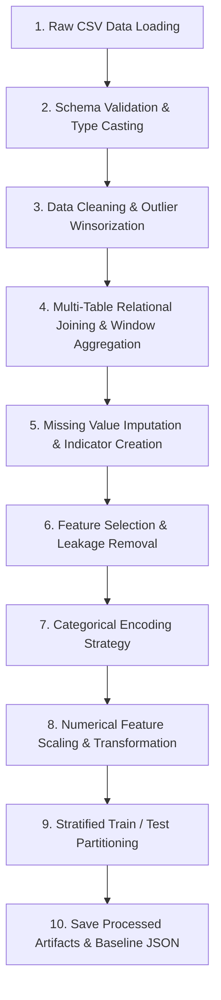

# Data Preprocessing Strategy Document

**Project Title:** An Automated MLOps Framework for Monitoring and Diagnosing Model Degradation in Production  
**Document Version:** 1.0.0  
**Status:** Approved / Draft  
**Target Component:** `src/ingestion/` & Data Pipeline Modules  
**Date:** September 2026  

---

## 1. Executive Summary & Strategy Overview

This document specifies the end-to-end data preprocessing strategy for transforming raw multi-table RavenStack SaaS CSV datasets (`accounts.csv`, `subscriptions.csv`, `feature_usage.csv`, `support_tickets.csv`) into a clean, normalized, scaled, single-row-per-account feature matrix ready for model training, baseline profiling, and drift evaluation.

---

## 2. Overall Preprocessing Workflow



---

## 3. Step-by-Step Preprocessing Specifications

### Step 1: Data Ingestion & Loading
- **Why Needed:** Ingests raw CSV datasets into in-memory Pandas DataFrames while isolating disk read routines from business logic.
- **How Implemented:** Implemented in `src/ingestion/csv_loader.py` using `pd.read_csv()`.
- **Expected Output:** Dictionary containing raw DataFrames for `accounts`, `subscriptions`, `feature_usage`, and `support_tickets`.

### Step 2: Schema Validation & Datetime Parsing
- **Why Needed:** Raw CSVs parse date columns as generic strings. Validating column presence and casting strings to `pd.to_datetime()` prevents downstream aggregation errors.
- **How Implemented:**
  - `accounts.signup_date` $\rightarrow$ `pd.to_datetime()`
  - `subscriptions.start_date`, `subscriptions.end_date` $\rightarrow$ `pd.to_datetime()`
  - `feature_usage.usage_date` $\rightarrow$ `pd.to_datetime()`
  - `support_tickets.submitted_at`, `support_tickets.closed_at` $\rightarrow$ `pd.to_datetime()`
- **Expected Output:** Properly typed DataFrames with datetime objects.

### Step 3: Data Cleaning & Outlier Winsorization
- **Why Needed:** Extreme long-tail outliers in resolution time ($> 150$ hours) distort linear models and continuous drift metrics.
- **How Implemented:** Winsorization at the 99th percentile for `resolution_time_hours` and `usage_duration_secs` using `np.clip()`.
- **Expected Output:** Cleaned numerical distributions bounded within realistic operational parameters.

### Step 4: Multi-Table Relational Joining & Entity Aggregation
- **Why Needed:** Machine learning algorithms require flat $N \times K$ feature matrices, whereas RavenStack stores data normalized across 4 relational tables.
- **How Implemented:** Executed in `src/ingestion/relational_joiner.py` and `feature_aggregator.py`:
  - `subscriptions` aggregated by `account_id`: `total_mrr = sum(mrr_amount)`, `max_seats = max(seats)`, `has_upgraded = max(upgrade_flag)`, `has_downgraded = max(downgrade_flag)`.
  - `feature_usage` joined via `subscription_id` and aggregated by `account_id`: `total_usage_count = sum(usage_count)`, `total_duration = sum(usage_duration_secs)`, `total_errors = sum(error_count)`, `beta_usage_ratio = mean(is_beta_feature)`.
  - `support_tickets` aggregated by `account_id`: `ticket_count = count(ticket_id)`, `avg_resolution_hours = mean(resolution_time_hours)`, `escalation_rate = mean(escalation_flag)`, `avg_csat = mean(satisfaction_score)`.
- **Expected Output:** Merged single-row-per-account DataFrame ($N = 500$).

### Step 5: Missing Value Imputation Strategy
- **Why Needed:** 41.25% of support tickets lack customer CSAT ratings (`satisfaction_score`), and accounts with 0 support tickets yield NULL ticket metrics post-join.
- **How Implemented:**
  - For `ticket_count`: Fill NULLs with `0`.
  - For `avg_resolution_hours` and `escalation_rate`: Fill NULLs with `0.0` (indicating no ticket friction).
  - For `avg_csat`: Create binary missingness flag `csat_missing_flag = 1` if NULL, and impute missing ratings with neutral median score `3.0`.
- **Expected Output:** Zero missing values across all merged feature columns.

### Step 6: Feature Selection & Leakage Removal
- **Why Needed:** Including post-churn event variables (`reason_code`, `refund_amount_usd` from `churn_events.csv`) or identifiers (`account_id`, `account_name`) causes severe data leakage or overfitting.
- **How Implemented:** Explicitly drop identifier columns, post-churn audit columns, and redundant variables (`arr_amount = 12 * mrr_amount`).
- **Expected Output:** Feature set consisting solely of valid pre-churn predictor variables.

### Step 7: Categorical Encoding Strategy
- **Why Needed:** Scikit-learn algorithms require numerical matrix inputs.
- **How Implemented:**
  - **`plan_tier`:** Ordinal Encoding (`Basic = 1`, `Pro = 2`, `Enterprise = 3`).
  - **`billing_frequency`:** Binary Encoding (`monthly = 0`, `annual = 1`).
  - **`industry` & `referral_source`:** One-Hot Encoding via `pd.get_dummies(drop_first=True)` or `OneHotEncoder()`.
  - **`country`:** Target Encoding or Top-K Frequency Encoding (`US`, `IN`, `DE`, `Other`).
- **Expected Output:** Fully numeric categorical feature representation.

### Step 8: Numerical Feature Scaling & Transformation
- **Why Needed:** Features with high numerical ranges (`mrr_amount`, `total_usage_duration_secs`) dominate distance-based algorithms and gradient descent optimizers.
- **How Implemented:**
  - Log Transformation $\ln(x+1)$ applied to skewed usage duration and session count variables.
  - `StandardScaler()` applied to continuous numerical features ($Z = \frac{x - \mu}{\sigma}$).
- **Expected Output:** Zero-mean, unit-variance scaled feature matrix.

### Step 9: Stratified Train / Test Partitioning
- **Why Needed:** Preserves target class distribution (22% churners) across training and evaluation sets.
- **How Implemented:** `train_test_split(X, y, test_size=0.2, stratify=y, random_state=42)`.
- **Expected Output:** 80% Training Set ($N=400$) and 20% Holdout Test Set ($N=100$).

### Step 10: Persisting Processed Datasets & Baseline Profile
- **Why Needed:** Saves processed feature matrices for model training and exports `baseline_reference.json` for production drift detection engines.
- **How Implemented:** Save `data/processed/training_features.csv` and export baseline distribution metadata.

---

## 4. Detailed Column Action Matrix

| Column Name | Source Table | Decision / Action | Rationale |
| :--- | :--- | :--- | :--- |
| `account_id` | `accounts` | **Remove** | Unique identifier; causes model overfitting. |
| `account_name` | `accounts` | **Remove** | Free-text string; zero predictive value. |
| `industry` | `accounts` | **Retain & One-Hot Encode** | Categorical feature driving vertical churn trends. |
| `country` | `accounts` | **Retain & Frequency Encode** | Geographic market feature. |
| `signup_date` | `accounts` | **Transform** | Transform to continuous `account_tenure_days`. |
| `referral_source` | `accounts` | **Retain & One-Hot Encode** | Acquisition channel feature. |
| `plan_tier` | `accounts` | **Retain & Ordinal Encode** | Subscription plan tier level (1, 2, 3). |
| `seats` | `accounts` | **Retain & Scale** | Continuous seat license capacity. |
| `is_trial` | `accounts` | **Retain** | Binary trial indicator. |
| `churn_flag` | `accounts` | **Retain (TARGET)** | Binary target variable ($0$ or $1$). |
| `mrr_amount` | `subscriptions` | **Aggregate (Sum) & Scale** | Sum MRR per account; critical revenue metric. |
| `arr_amount` | `subscriptions` | **Remove** | Perfectly collinear with `mrr_amount` ($12 \times \text{MRR}$). |
| `upgrade_flag` | `subscriptions` | **Aggregate (Max)** | Binary flag indicating historical plan upgrade. |
| `downgrade_flag` | `subscriptions` | **Aggregate (Max)** | Binary flag indicating historical plan downgrade. |
| `billing_frequency` | `subscriptions` | **Retain & Binary Encode** | Monthly ($0$) vs Annual ($1$). |
| `usage_count` | `feature_usage` | **Aggregate (Sum) & Log-Transform** | Total product session frequency. |
| `usage_duration_secs` | `feature_usage` | **Aggregate (Sum) & Log-Transform** | Total time spent in application. |
| `error_count` | `feature_usage` | **Aggregate (Sum)** | Total application error logs encountered. |
| `is_beta_feature` | `feature_usage` | **Aggregate (Mean)** | Ratio of usage spent in beta features. |
| `resolution_time_hours` | `support_tickets` | **Aggregate (Mean) & Winsorize** | Average support ticket resolution duration. |
| `satisfaction_score` | `support_tickets` | **Aggregate (Mean) & Impute** | Average CSAT rating; median impute missing values. |
| `escalation_flag` | `support_tickets` | **Aggregate (Mean)** | Ticket escalation rate per account. |
| `reason_code` | `churn_events` | **REMOVE (LEAKAGE)** | Post-churn audit variable; causes data leakage. |
| `refund_amount_usd` | `churn_events` | **REMOVE (LEAKAGE)** | Post-churn audit variable; causes data leakage. |

---

## 5. Complete Preprocessing Pipeline Code Specification

Below is the production-ready Python preprocessing script specification implemented in `src/ingestion/preprocessing_pipeline.py`.

```python
import pandas as pd
import numpy as np
from sklearn.model_selection import train_test_split
from sklearn.preprocessing import StandardScaler, OrdinalEncoder

class PreprocessingPipeline:
    def __init__(self, raw_data: dict):
        self.accounts_df = raw_data["accounts"].copy()
        self.subscriptions_df = raw_data["subscriptions"].copy()
        self.usage_df = raw_data["usage"].copy()
        self.tickets_df = raw_data["tickets"].copy()
        self.scaler = StandardScaler()

    def process(self):
        # 1. Parse Datetimes
        self.accounts_df["signup_date"] = pd.to_datetime(self.accounts_df["signup_date"])
        eval_date = pd.to_datetime("2026-09-02")
        self.accounts_df["account_tenure_days"] = (eval_date - self.accounts_df["signup_date"]).dt.days

        # 2. Aggregate Subscriptions
        sub_agg = self.subscriptions_df.groupby("account_id").agg(
            total_mrr=("mrr_amount", "sum"),
            max_seats=("seats", "max"),
            has_upgraded=("upgrade_flag", "max"),
            has_downgraded=("downgrade_flag", "max"),
            is_annual=("billing_frequency", lambda x: int("annual" in x.values))
        ).reset_index()

        # 3. Aggregate Usage (via subscription_id -> account_id)
        usage_merged = self.usage_df.merge(self.subscriptions_df[["subscription_id", "account_id"]], on="subscription_id")
        usage_agg = usage_merged.groupby("account_id").agg(
            total_usage_count=("usage_count", "sum"),
            total_duration_secs=("usage_duration_secs", "sum"),
            total_errors=("error_count", "sum"),
            beta_usage_ratio=("is_beta_feature", "mean")
        ).reset_index()

        # 4. Aggregate Support Tickets
        ticket_agg = self.tickets_df.groupby("account_id").agg(
            ticket_count=("ticket_id", "count"),
            avg_resolution_hours=("resolution_time_hours", "mean"),
            avg_csat=("satisfaction_score", "mean"),
            escalation_rate=("escalation_flag", "mean")
        ).reset_index()

        # 5. Merge all to Accounts Base Table
        df = self.accounts_df.merge(sub_agg, on="account_id", how="left")
        df = df.merge(usage_agg, on="account_id", how="left")
        df = df.merge(ticket_agg, on="account_id", how="left")

        # 6. Impute Missing Values
        df["ticket_count"] = df["ticket_count"].fillna(0)
        df["avg_resolution_hours"] = df["avg_resolution_hours"].fillna(0.0)
        df["total_errors"] = df["total_errors"].fillna(0)
        df["csat_missing_flag"] = df["avg_csat"].isnull().astype(int)
        df["avg_csat"] = df["avg_csat"].fillna(3.0) # Median neutral CSAT

        # 7. Winsorize Outliers
        df["avg_resolution_hours"] = np.clip(df["avg_resolution_hours"], 0, np.percentile(df["avg_resolution_hours"], 99))
        df["log_duration_secs"] = np.log1p(df["total_duration_secs"].fillna(0))

        # 8. Encode Categoricals
        tier_map = {"Basic": 1, "Pro": 2, "Enterprise": 3}
        df["plan_tier_code"] = df["plan_tier"].map(tier_map)
        df = pd.get_dummies(df, columns=["industry", "referral_source"], drop_first=True)

        # 9. Extract Target and Feature Matrix
        y = df["churn_flag"].astype(int)
        drop_cols = ["account_id", "account_name", "country", "signup_date", "plan_tier", "churn_flag", "total_duration_secs"]
        X = df.drop(columns=[c for c in drop_cols if c in df.columns])

        # 10. Scale Continuous Features
        num_cols = ["account_tenure_days", "seats", "total_mrr", "max_seats", "total_usage_count", "log_duration_secs", "total_errors", "avg_resolution_hours", "avg_csat"]
        X[num_cols] = self.scaler.fit_transform(X[num_cols])

        # 11. Stratified Split
        X_train, X_test, y_train, y_test = train_test_split(X, y, test_size=0.2, stratify=y, random_state=42)

        return X_train, X_test, y_train, y_test
```

---

## 6. Document Approval & Sign-Off

- **Prepared By:** Senior Data Engineer & ML Pipeline Architect  
- **Reviewed By:** Data Scientist & Lead Backend Engineer  
- **Status:** Approved for Implementation  

---
