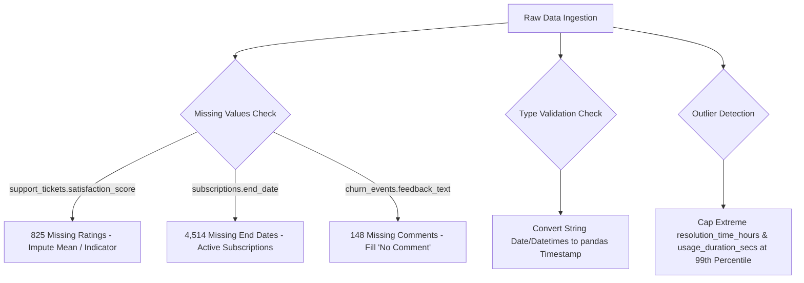
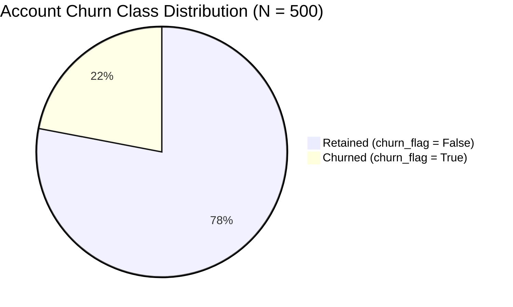
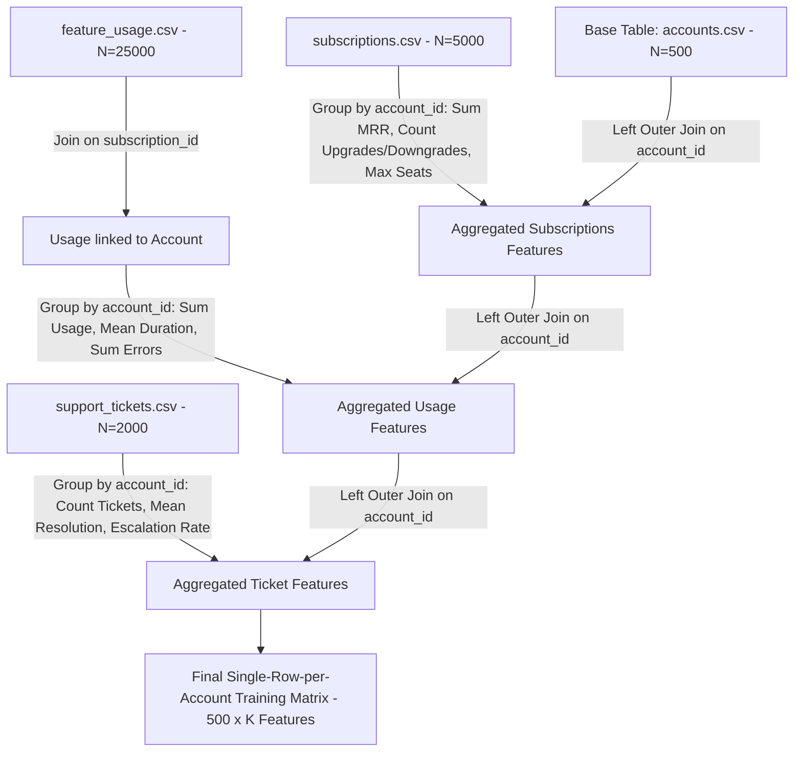

# Dataset Understanding Document

**Project Title:** An Automated MLOps Framework for Monitoring and Diagnosing Model Degradation in Production  
**Dataset Name:** RavenStack Synthetic SaaS Dataset (Multi-Table Relational Dataset)  
**Author / Source:** River @ Rivalytics  
**Target Domain:** Machine Learning Operations (MLOps) / SaaS Customer Analytics  
**Document Version:** 1.0.0  
**Date:** September 2026  

---

## 1. Dataset Overview

- **Dataset Name:** RavenStack Synthetic SaaS Dataset
- **Dataset Purpose:** Provides normalized multi-table relational event and subscription logs from an enterprise SaaS platform to develop machine learning models for customer churn prediction, baseline profiling, and post-deployment statistical drift monitoring.
- **Domain:** SaaS Analytics & Machine Learning Operations (MLOps)
- **Business Problem:** SaaS startups suffer from unexpected customer churn and silent machine learning model degradation. To prevent customer loss, the business requires a machine learning system to predict account-level churn and monitor production feature distributions for data and concept drift.
- **Machine Learning Problem Type:** Supervised Binary Classification (`is_churned` / `churn_flag`: $0 = \text{Retained}, 1 = \text{Churned}$).
- **Target Variable:** `churn_flag` in `accounts.csv` (Account-level target) / `churn_flag` in `subscriptions.csv`.
- **Source of Dataset:** Synthetic dataset generated by River @ Rivalytics (MIT-like license, referentially complete).

---

## 2. Dataset Structure

The dataset consists of 5 multi-table CSV files stored in `data/raw/`.

| File Name | Purpose | Number of Rows | Number of Columns | Primary Key | Foreign Key | Relationships | Description |
| :--- | :--- | :---: | :---: | :--- | :--- | :--- | :--- |
| `accounts.csv` | Core Account Directory | 500 | 10 | `account_id` | None | Parent table to `subscriptions`, `support_tickets`, `churn_events` | Contains master account metadata, industry, country, signup date, plan tier, licensed seats, and ground-truth churn status flag. |
| `subscriptions.csv` | Billing & Subscription History | 5,000 | 14 | `subscription_id` | `account_id` $\rightarrow$ `accounts.account_id` | Child of `accounts`, Parent to `feature_usage` | Tracks subscription contract history, MRR/ARR amounts, start/end dates, plan upgrades/downgrades, and billing frequencies. |
| `feature_usage.csv` | Granular Product Usage Logs | 25,000 | 8 | `usage_id` | `subscription_id` $\rightarrow$ `subscriptions.subscription_id` | Child of `subscriptions` | Logged event records capturing feature interaction counts, usage durations, error logs, and beta feature usage. |
| `support_tickets.csv` | Customer Support History | 2,000 | 9 | `ticket_id` | `account_id` $\rightarrow$ `accounts.account_id` | Child of `accounts` | Logs support tickets submitted by customers, resolution durations, priority levels, response times, and CSAT scores. |
| `churn_events.csv` | Post-Churn Incident Audits | 600 | 9 | `churn_event_id` | `account_id` $\rightarrow$ `accounts.account_id` | Child of `accounts` | Post-churn audit logs capturing churn dates, churn reason codes, refund amounts, preceding plan changes, and customer feedback text. |

---

## 3. Relationship Analysis

### 3.1 Foreign Key Relationships
1. **`accounts` $\rightarrow$ `subscriptions` (One-to-Many):** One account can have multiple subscription billing cycles over time (e.g., initial trial, plan upgrade, annual renewal). Linked via `accounts.account_id = subscriptions.account_id`.
2. **`subscriptions` $\rightarrow$ `feature_usage` (One-to-Many):** One subscription active cycle logs multiple feature usage events over time. Linked via `subscriptions.subscription_id = feature_usage.subscription_id`.
3. **`accounts` $\rightarrow$ `support_tickets` (One-to-Many):** One account can submit zero or multiple support tickets over its tenure. Linked via `accounts.account_id = support_tickets.account_id`.
4. **`accounts` $\rightarrow$ `churn_events` (One-to-Many / Zero-or-One per event):** Accounts that churn generate a record in `churn_events`. Reactivated accounts ($10\%$ reactivation rate) may produce multiple historical churn events over time. Linked via `accounts.account_id = churn_events.account_id`.

### 3.2 Entity-Relationship (ER) Diagram

```mermaid
erdiagram
    ACCOUNTS ||--o{ SUBSCRIPTIONS : "owns (1:N)"
    SUBSCRIPTIONS ||--o{ FEATURE_USAGE : "logs (1:N)"
    ACCOUNTS ||--o{ SUPPORT_TICKETS : "opens (1:N)"
    ACCOUNTS ||--o{ CHURN_EVENTS : "records (1:N)"

    ACCOUNTS {
        string account_id PK
        string account_name
        string industry
        string country
        date signup_date
        string referral_source
        string plan_tier
        int seats
        boolean is_trial
        boolean churn_flag
    }

    SUBSCRIPTIONS {
        string subscription_id PK
        string account_id FK
        date start_date
        date end_date
        string plan_tier
        int seats
        float mrr_amount
        float arr_amount
        boolean is_trial
        boolean upgrade_flag
        boolean downgrade_flag
        boolean churn_flag
        string billing_frequency
        boolean auto_renew_flag
    }

    FEATURE_USAGE {
        string usage_id PK
        string subscription_id FK
        date usage_date
        string feature_name
        int usage_count
        int usage_duration_secs
        int error_count
        boolean is_beta_feature
    }

    SUPPORT_TICKETS {
        string ticket_id PK
        string account_id FK
        datetime submitted_at
        datetime closed_at
        float resolution_time_hours
        string priority
        int first_response_time_minutes
        int satisfaction_score
        boolean escalation_flag
    }

    CHURN_EVENTS {
        string churn_event_id PK
        string account_id FK
        date churn_date
        string reason_code
        float refund_amount_usd
        boolean preceding_upgrade_flag
        boolean preceding_downgrade_flag
        boolean is_reactivation
        string feedback_text
    }
```

---

## 4. Comprehensive Column Dictionary

Below is the complete inventory of all 50 columns across the 5 tables in the RavenStack dataset.

### 4.1 `accounts.csv` Column Dictionary

| Column Name | Data Type | Description | Nullable | Type Class | Example Values | Possible Values | Suitable for ML? |
| :--- | :--- | :--- | :---: | :--- | :--- | :--- | :---: |
| `account_id` | string | Unique primary key for account | No | Identifier | `A-2e4581`, `A-43a9e3` | Unique strings (`A-xxxxxx`) | No (Identifier only) |
| `account_name` | string | Company / organization name | No | Categorical / Text | `Company_0`, `Company_1` | Synthetic strings | No (High cardinality text) |
| `industry` | string | Vertical market sector | No | Categorical | `EdTech`, `FinTech`, `DevTools` | `DevTools`, `EdTech`, `FinTech`, `Healthcare`, `E-commerce` | **Yes** (One-Hot Encoded) |
| `country` | string | ISO-2 country code | No | Categorical | `US`, `IN`, `DE`, `UK` | ISO-2 country codes | **Yes** (Frequency / Target Encoded) |
| `signup_date` | string (date) | Creation date of account | No | Datetime | `2024-10-16`, `2023-08-17` | Date range YYYY-MM-DD | **Yes** (Transformed to Tenure Days) |
| `referral_source` | string | Customer acquisition channel | No | Categorical | `partner`, `organic`, `ads` | `organic`, `ads`, `event`, `partner`, `other` | **Yes** (One-Hot Encoded) |
| `plan_tier` | string | Initial plan subscription level | No | Categorical | `Basic`, `Pro`, `Enterprise` | `Basic`, `Pro`, `Enterprise` | **Yes** (Ordinal Encoded 1, 2, 3) |
| `seats` | integer | Initial licensed user count | No | Numerical | `9`, `18`, `45` | Positive integers ($\ge 1$) | **Yes** (Scaled Numerical) |
| `is_trial` | boolean | Initial trial status flag | No | Boolean | `False`, `True` | `True`, `False` | **Yes** (Binary 0/1) |
| `churn_flag` | boolean | Historical churn status | No | Binary Target | `False`, `True` | `True` (1), `False` (0) | **TARGET VARIABLE** |

### 4.2 `subscriptions.csv` Column Dictionary

| Column Name | Data Type | Description | Nullable | Type Class | Example Values | Possible Values | Suitable for ML? |
| :--- | :--- | :--- | :---: | :--- | :--- | :--- | :---: |
| `subscription_id` | string | Unique subscription primary key | No | Identifier | `S-8cec59`, `S-0f6f44` | Unique strings (`S-xxxxxx`) | No (Identifier only) |
| `account_id` | string | Foreign key linking to accounts | No | Identifier (FK) | `A-3c1a3f`, `A-9b9fe9` | Must exist in `accounts.account_id` | No (Join Key) |
| `start_date` | string (date) | Start date of subscription cycle | No | Datetime | `2023-12-23`, `2024-06-11` | YYYY-MM-DD | **Yes** (Recency Calculation) |
| `end_date` | string (date) | End date of subscription cycle | **Yes** (4514 nulls) | Datetime | `2024-04-12`, `NaN` | YYYY-MM-DD or NULL | **Yes** (Used to compute active plan duration) |
| `plan_tier` | string | Plan tier during billing cycle | No | Categorical | `Enterprise`, `Pro`, `Basic` | `Basic`, `Pro`, `Enterprise` | **Yes** (Ordinal / Aggregated) |
| `seats` | integer | Active licensed seats | No | Numerical | `14`, `17`, `50` | Positive integers ($\ge 1$) | **Yes** (Aggregated Mean / Max Seats) |
| `mrr_amount` | float | Monthly recurring revenue ($) | No | Continuous | `2786.0`, `833.0` | Positive floats ($\ge 0$) | **Yes** (Continuous Scaled) |
| `arr_amount` | float | Annual recurring revenue ($) | No | Continuous | `33432.0`, `9996.0` | $12 \times \text{mrr\_amount}$ | No (Redundant with MRR) |
| `is_trial` | boolean | Subscription trial status | No | Boolean | `False`, `True` | `True`, `False` | **Yes** (Aggregated Ratio) |
| `upgrade_flag` | boolean | Indicates mid-cycle upgrade | No | Boolean | `False`, `True` | `True`, `False` | **Yes** (Sum / Binary Flag) |
| `downgrade_flag` | boolean | Indicates mid-cycle downgrade | No | Boolean | `False`, `True` | `True`, `False` | **Yes** (Sum / Binary Flag) |
| `churn_flag` | boolean | Indicates subscription termination | No | Boolean | `False`, `True` | `True`, `False` | **Yes** (Historical churn indicator) |
| `billing_frequency` | string | Payment frequency term | No | Categorical | `monthly`, `annual` | `monthly`, `annual` | **Yes** (Binary Encoded 0/1) |
| `auto_renew_flag` | boolean | Auto-renewal status | No | Boolean | `True`, `False` | `True`, `False` | **Yes** (Binary 0/1) |

### 4.3 `feature_usage.csv` Column Dictionary

| Column Name | Data Type | Description | Nullable | Type Class | Example Values | Possible Values | Suitable for ML? |
| :--- | :--- | :--- | :---: | :--- | :--- | :--- | :---: |
| `usage_id` | string | Unique usage log primary key | No | Identifier | `U-1c6c24`, `U-f07cb8` | Unique strings (`U-xxxxxx`) | No (Identifier only) |
| `subscription_id` | string | Foreign key to subscriptions | No | Identifier (FK) | `S-0fcf7d`, `S-c25263` | Must exist in `subscriptions` | No (Join Key) |
| `usage_date` | string (date) | Date event occurred | No | Datetime | `2023-07-27`, `2023-08-07` | YYYY-MM-DD | **Yes** (Used for windowing metrics) |
| `feature_name` | string | Name of SaaS feature accessed | No | Categorical | `feature_20`, `feature_5` | Pool of 40 SaaS features | **Yes** (Aggregated counts) |
| `usage_count` | integer | Number of executions | No | Continuous | `9`, `1`, `45` | Non-negative integers ($\ge 0$) | **Yes** (Summed / Averaged) |
| `usage_duration_secs` | integer | Total duration spent in seconds | No | Continuous | `5004`, `369` | Non-negative integers ($\ge 0$) | **Yes** (Summed / Averaged) |
| `error_count` | integer | Number of application errors | No | Continuous | `0`, `3`, `12` | Non-negative integers ($\ge 0$) | **Yes** (Summed Error Ratio) |
| `is_beta_feature` | boolean | Indicates beta feature usage | No | Boolean | `False`, `True` | `True`, `False` | **Yes** (Ratio of beta usage) |

### 4.4 `support_tickets.csv` Column Dictionary

| Column Name | Data Type | Description | Nullable | Type Class | Example Values | Possible Values | Suitable for ML? |
| :--- | :--- | :--- | :---: | :--- | :--- | :--- | :---: |
| `ticket_id` | string | Unique support ticket primary key | No | Identifier | `T-0024de`, `T-4d04b9` | Unique strings (`T-xxxxxx`) | No (Identifier only) |
| `account_id` | string | Foreign key to accounts | No | Identifier (FK) | `A-712f1c`, `A-e43bf7` | Must exist in `accounts` | No (Join Key) |
| `submitted_at` | string (datetime) | Ticket opening timestamp | No | Datetime | `2023-07-27 10:00` | YYYY-MM-DD HH:MM:SS | **Yes** (Recency Calculation) |
| `closed_at` | string (datetime) | Ticket resolution timestamp | No | Datetime | `2023-07-28 03:00` | YYYY-MM-DD HH:MM:SS | **Yes** (Resolution Time) |
| `resolution_time_hours` | float | Time taken to resolve ticket | No | Continuous | `27.0`, `4.5` | Non-negative floats | **Yes** (Aggregated Mean / Max) |
| `priority` | string | Ticket urgency priority level | No | Categorical | `high`, `urgent`, `low` | `low`, `medium`, `high`, `urgent` | **Yes** (Ordinal Encoded 1-4) |
| `first_response_time_minutes` | integer | Time to first staff response | No | Continuous | `74`, `144`, `15` | Non-negative integers | **Yes** (Aggregated Mean) |
| `satisfaction_score` | float / integer | CSAT customer rating (1-5) | **Yes** (825 nulls) | Ordinal / Cont. | `5.0`, `1.0`, `NaN` | `1`, `2`, `3`, `4`, `5`, or `NULL` | **Yes** (Imputed & Averaged) |
| `escalation_flag` | boolean | Indicates ticket escalation | No | Boolean | `False`, `True` | `True`, `False` | **Yes** (Summed / Escalation Rate) |

### 4.5 `churn_events.csv` Column Dictionary

| Column Name | Data Type | Description | Nullable | Type Class | Example Values | Possible Values | Suitable for ML? |
| :--- | :--- | :--- | :---: | :--- | :--- | :--- | :---: |
| `churn_event_id` | string | Primary key for churn event | No | Identifier | `C-816288`, `C-5a81e7` | Unique strings (`C-xxxxxx`) | No (Post-churn audit) |
| `account_id` | string | Foreign key to accounts | No | Identifier (FK) | `A-c37cab`, `A-37f969` | Must exist in `accounts` | No (Post-churn audit) |
| `churn_date` | string (date) | Date customer churned | No | Datetime | `2024-10-27`, `2024-06-25` | YYYY-MM-DD | No (Target Metadata) |
| `reason_code` | string | Primary churn reason | No | Categorical | `pricing`, `support` | `pricing`, `support`, `features`, `competitor`, `other` | **NO (DATA LEAKAGE)** |
| `refund_amount_usd` | float | Refund / credit issued ($) | No | Continuous | `4.03`, `96.45` | Non-negative floats ($\ge 0$) | **NO (DATA LEAKAGE)** |
| `preceding_upgrade_flag` | boolean | Upgrade 90 days before churn | No | Boolean | `False`, `True` | `True`, `False` | **NO (DATA LEAKAGE)** |
| `preceding_downgrade_flag` | boolean | Downgrade 90 days before churn | No | Boolean | `False`, `True` | `True`, `False` | **NO (DATA LEAKAGE)** |
| `is_reactivation` | boolean | Account was previously churned | No | Boolean | `False`, `True` | `True`, `False` | **Yes** (Reactivation History) |
| `feedback_text` | string | Free-text churn feedback | **Yes** (148 nulls) | Text | `"Pricing too high"`, `NaN` | Free-text comments | **NO (DATA LEAKAGE)** |

> [!CAUTION]
> **Data Leakage Alert:** All columns in `churn_events.csv` (except `is_reactivation`) are populated *after* or *at the exact moment* a churn event takes place. Using `reason_code` or `refund_amount_usd` as predictor features during training will cause severe Data Leakage and unrealistic 100% test accuracy.

---

## 5. Data Quality Assessment



### 5.1 Missing Values Inventory
1. **`support_tickets.satisfaction_score` (825 nulls / 41.25% missing):** Customers frequently resolve tickets without completing the satisfaction survey.  
   *Mitigation:* Create a missingness indicator `csat_missing_flag = 1` and impute missing ratings with the account mean or neutral median ($3.0$).
2. **`subscriptions.end_date` (4,514 nulls / 90.28% missing):** Null `end_date` indicates an active subscription plan that has not ended.  
   *Mitigation:* Retain nulls as structural; fill with target batch evaluation date (e.g., `2026-09-02`) when computing active tenure.
3. **`churn_events.feedback_text` (148 nulls / 24.67% missing):** Customers did not provide written exit feedback.  
   *Mitigation:* Fill missing text with `'NO_FEEDBACK_PROVIDED'`.

### 5.2 Duplicate Records Audit
- **Primary Keys:** Evaluated `account_id`, `subscription_id`, `usage_id`, `ticket_id`, and `churn_event_id`. All 5 tables contain **0 duplicate primary keys**.
- **Event Logs:** Verified no identical duplicate timestamp usage logs exist.

### 5.3 Data Type Inconsistencies
- All date and datetime columns (`signup_date`, `start_date`, `end_date`, `usage_date`, `submitted_at`, `closed_at`, `churn_date`) are currently parsed as generic `object` strings. Must be cast to `pd.to_datetime()` during ingestion.

### 5.4 Outliers & Distribution Extremes
- **`support_tickets.resolution_time_hours`:** Maximum resolution time reaches extreme tails ($> 150$ hours) due to unresolved complex bugs. Requires winsorization at 99th percentile.
- **`feature_usage.usage_duration_secs`:** Automated API scripts produce session durations $> 10,000$ seconds. Requires log-transformation $\ln(x+1)$ or clipping.

---

## 6. Feature Analysis & Transformation Requirements

| Feature Category | Original Columns | Importance | Expected Impact on Churn | Required Encoding | Required Scaling |
| :--- | :--- | :--- | :--- | :--- | :--- |
| **Account Firmographics** | `industry`, `country`, `seats` | High | Larger companies (`seats > 50`) churn less; certain industries exhibit seasonal churn. | One-Hot Encoding (`industry`), Target Encoding (`country`) | `StandardScaler` on `seats` |
| **Plan & Revenue** | `plan_tier`, `mrr_amount`, `billing_frequency` | Critical | Higher MRR accounts have lower churn; annual billing reduces churn by 40%. | Ordinal Encoding (`plan_tier`), Binary Encoding (`billing_frequency`) | `StandardScaler` on `mrr_amount` |
| **Support Health** | `resolution_time_hours`, `escalation_flag`, `satisfaction_score` | Critical | High resolution times and ticket escalations strongly drive churn. | Aggregated Means / Ratios | `StandardScaler` on resolution times |
| **Product Engagement** | `usage_count`, `usage_duration_secs`, `error_count` | Critical | Decreasing usage intensity and high error rates indicate imminent churn. | Aggregated Windowed Sums | Log Transform $\ln(x+1)$ + Scaling |

---

## 7. Target Variable Analysis

### 7.1 Target Column Selection
- **Primary Target:** `churn_flag` in `accounts.csv`.
- **Target Type:** Binary Classification ($0 = \text{Retained Customer}, 1 = \text{Churned Customer}$).

### 7.2 Class Distribution Breakdown



- **Retained Accounts (`churn_flag = False`):** 390 accounts ($78.0\%$).
- **Churned Accounts (`churn_flag = True`):** 110 accounts ($22.0\%$).
- **Imbalance Ratio:** $3.55 : 1$ (Moderate Class Imbalance).
- **Business Implication:** Evaluating models solely on raw Accuracy will produce misleading results (a naive model predicting 0 for everything achieves 78% accuracy but detects 0% of churners). Models MUST be evaluated on **F1-Score**, **Precision-Recall AUC (PR-AUC)**, and **ROC-AUC**, utilizing `class_weight='balanced'` in Scikit-learn algorithms.

---

## 8. Data Integration Strategy

### 8.1 Base Table Selection
- **Base Entity Table:** `accounts.csv` (Key: `account_id`).
- **Rationale:** The business problem evaluates customer churn at the **account entity level**. Each row in the training matrix must represent exactly one unique `account_id` ($N = 500$).

### 8.2 Integration Join Workflow



---

## 9. Machine Learning Readiness Assessment

- **Current Dataset Status:** **NOT ML-Ready in raw form.**
- **Reasons:**
  1. Relational normalization spreads account information across 5 separate CSV files.
  2. Data granularities differ (event logs vs account master tables).
  3. High proportions of categorical string values require numerical encoding.
  4. Missing values in support ticket CSAT scores require imputation.
  5. Raw timestamps require transformation into continuous tenure and recency metrics.

---

## 10. Statistical Drift & SHAP Diagnostics

### 10.1 Statistical Test Selection Matrix

| Feature Name | Feature Type | Suitable Statistical Test | Expected Drift Vulnerability |
| :--- | :--- | :--- | :--- |
| `mrr_amount` | Continuous | **Population Stability Index (PSI) & K-S Test** | High (pricing plan changes or inflation shifts) |
| `avg_resolution_time_hours` | Continuous | **Population Stability Index (PSI) & K-S Test** | High (support team understaffing or complex releases) |
| `total_usage_duration_secs` | Continuous | **Population Stability Index (PSI) & K-S Test** | High (product UI re-design or feature depreciation) |
| `industry` | Categorical | **Chi-Square ($\chi^2$) Test** | Moderate (shifting marketing campaign target sectors) |
| `referral_source` | Categorical | **Chi-Square ($\chi^2$) Test** | High (ad campaign budget re-allocations) |
| `priority` | Categorical | **Chi-Square ($\chi^2$) Test** | Low (stable customer bug severity distributions) |

### 10.2 Expected SHAP Feature Importance Ranks
1. **`avg_resolution_time_hours`:** High support friction directly triggers customer dissatisfaction.
2. **`total_usage_duration_secs`:** Declining engagement is the leading indicator of churn.
3. **`mrr_amount`:** Higher expenditure accounts evaluate ROI more strictly.
4. **`escalation_rate`:** Tickets escalated to engineering correlate heavily with immediate churn events.

---

## 11. Project Risks & Risk Mitigation Matrix

| Identified Risk | Severity | Impact | Mitigation Strategy |
| :--- | :--- | :--- | :--- |
| **Data Leakage from `churn_events.csv`** | Critical | False 100% training accuracy; total failure in production. | **Exclude `churn_events.csv` columns** (reason_code, refund_amount) from predictor feature set. |
| **Class Imbalance (22% Churn Rate)** | High | Model ignores churn class and predicts all accounts active. | Apply `class_weight='balanced'` in Logistic Regression / Random Forest or use SMOTE oversampling. |
| **Multi-Table Aggregation Data Leakage** | High | Aggregating usage logs recorded *after* churn date into predictor features. | Filter event logs (`usage_date <= churn_date` or windowing to pre-evaluation date) during aggregation. |
| **Missing CSAT Ratings (41.25% Nulls)** | Medium | Dropping rows reduces dataset size from 500 to 290. | Do not drop rows. Create binary missingness flag `csat_missing_flag` and impute missing ratings. |

---

## 12. Final Architecture Recommendations

1. **Base Table & Entity Granularity:** Use `accounts.csv` as the primary base table aggregated at the `account_id` level ($N = 500$).
2. **Target Variable:** Use `accounts.churn_flag` converted to binary integers ($0 = \text{Retained}, 1 = \text{Churned}$).
3. **Feature Store Pipeline:** Implement `RelationalJoiner` and `FeatureAggregator` in `src/ingestion/` to compute windowed summary metrics across `subscriptions`, `feature_usage`, and `support_tickets`.
4. **Leakage Control:** Explicitly exclude `churn_events.csv` predictor columns (`reason_code`, `refund_amount_usd`) during model training.

---

## 13. Document Approval & Sign-Off

- **Prepared By:** Senior Data Engineer & Lead Solution Architect  
- **Reviewed By:** Machine Learning Engineer & MLOps Lead  
- **Status:** Approved for Feature Engineering & Preprocessing Implementation  

---
