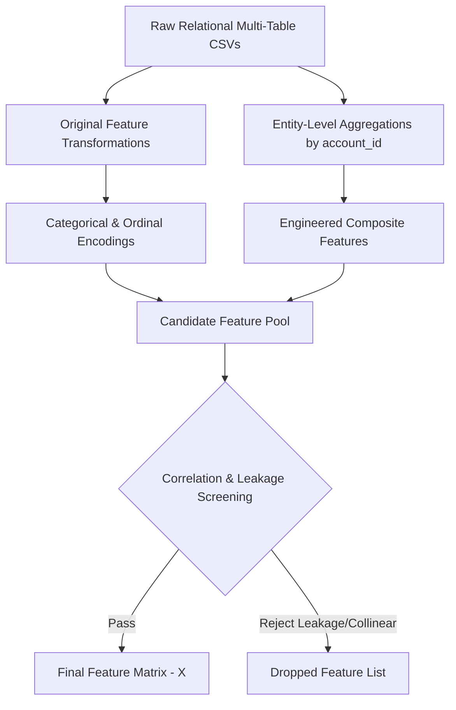

# Feature Engineering Plan Document

**Project Title:** An Automated MLOps Framework for Monitoring and Diagnosing Model Degradation in Production  
**Document Version:** 1.0.0  
**Status:** Approved / Draft  
**Target Component:** `src/ingestion/feature_aggregator.py` & ML Engine  
**Date:** September 2026  

---

## 1. Executive Summary

This document specifies the **Feature Engineering Plan** for transforming raw relational data into high-predictive-power signals. By aggregating transaction and event logs into domain-specific SaaS metrics (e.g., usage intensity, revenue per seat, support friction, plan stability), the feature engineering engine provides the predictive substrate for churn classification and post-deployment statistical drift diagnosis.

---

## 2. Feature Engineering Workflow

---

## 3. Original Feature Action Matrix

Below is the definitive classification of how every raw column across the 5 RavenStack tables is handled in the feature engineering pipeline.

| Original Column Name | Source Table | Treatment Action | Detailed Processing Strategy |
| :--- | :--- | :---: | :--- |
| `account_id` | `accounts` | **Removed** | Primary key identifier; excluded from training matrix to prevent lookup memorization. |
| `account_name` | `accounts` | **Removed** | Free-text string; zero predictive value. |
| `industry` | `accounts` | **Encoded** | One-Hot Encoded (`industry_DevTools`, `industry_EdTech`, `industry_FinTech`). |
| `country` | `accounts` | **Encoded** | Top-K Frequency Encoded (`country_US`, `country_IN`, `country_DE`, `country_Other`). |
| `signup_date` | `accounts` | **Modified** | Converted to continuous scalar `account_tenure_days = (Evaluation Date - signup_date)`. |
| `referral_source` | `accounts` | **Encoded** | One-Hot Encoded (`referral_partner`, `referral_organic`, `referral_ads`). |
| `plan_tier` | `accounts` | **Encoded** | Ordinal Encoded (`Basic = 1`, `Pro = 2`, `Enterprise = 3`). |
| `seats` | `accounts` | **Used Directly & Scaled** | Continuous numerical feature representing initial seat capacity. |
| `is_trial` | `accounts` | **Used Directly** | Binary boolean flag ($0$ or $1$). |
| `churn_flag` | `accounts` | **Target Variable** | Binary classification ground-truth target ($0 = \text{Retained}, 1 = \text{Churned}$). |
| `subscription_id` | `subscriptions` | **Removed** | Subscription entity primary key; used solely for joining `feature_usage`. |
| `mrr_amount` | `subscriptions` | **Aggregated** | Summed across active subscriptions to yield `total_mrr`. |
| `arr_amount` | `subscriptions` | **Removed** | Perfectly collinear ($12 \times \text{mrr\_amount}$); redundant. |
| `upgrade_flag` | `subscriptions` | **Aggregated** | Max-pooled across subscriptions to yield `has_upgraded` ($0$ or $1$). |
| `downgrade_flag` | `subscriptions` | **Aggregated** | Max-pooled across subscriptions to yield `has_downgrade` ($0$ or $1$). |
| `billing_frequency` | `subscriptions` | **Encoded** | Binary Encoded (`monthly = 0`, `annual = 1`). |
| `auto_renew_flag` | `subscriptions` | **Used Directly** | Binary boolean flag ($0$ or $1$). |
| `usage_count` | `feature_usage` | **Aggregated & Modified** | Summed to `total_usage_count` and log-transformed $\ln(x+1)$. |
| `usage_duration_secs` | `feature_usage` | **Aggregated & Modified** | Summed to `total_duration_hours = sum(secs)/3600` and log-transformed. |
| `error_count` | `feature_usage` | **Aggregated & Modified** | Summed to `total_errors` and divided by usage count to yield `error_rate`. |
| `is_beta_feature` | `feature_usage` | **Aggregated** | Averaged across account events to yield `beta_feature_usage_ratio`. |
| `ticket_id` | `support_tickets` | **Aggregated** | Counted per `account_id` to yield `total_support_tickets`. |
| `resolution_time_hours` | `support_tickets` | **Aggregated & Winsorized** | Averaged to `avg_resolution_time_hours` and clipped at 99th percentile. |
| `satisfaction_score` | `support_tickets` | **Aggregated & Imputed** | Averaged to `avg_csat_score`; missing values median-imputed ($3.0$). |
| `escalation_flag` | `support_tickets` | **Aggregated** | Averaged to `escalation_rate` (ratio of tickets escalated). |
| `first_response_time_minutes` | `support_tickets` | **Aggregated** | Averaged to `avg_first_response_minutes`. |
| `reason_code` | `churn_events` | **REMOVED (LEAKAGE)** | Post-churn audit data; causes fatal data leakage. |
| `refund_amount_usd` | `churn_events` | **REMOVED (LEAKAGE)** | Post-churn audit data; causes fatal data leakage. |
| `preceding_upgrade_flag` | `churn_events` | **REMOVED (LEAKAGE)** | Post-churn audit data; causes fatal data leakage. |
| `preceding_downgrade_flag` | `churn_events` | **REMOVED (LEAKAGE)** | Post-churn audit data; causes fatal data leakage. |

---

## 4. Recommended Engineered Features Specification

Below are 12 high-impact engineered features generated by aggregating and combining raw multi-table inputs.

### Feature 1: `account_tenure_days`
- **Formula:** $\text{Tenure Days} = \text{Date}(\text{"2026-09-02"}) - \text{signup\_date}$
- **Source Columns:** `accounts.signup_date`
- **Business Meaning:** Total calendar days the customer account has existed on the platform.
- **Predictive Value:** Newer accounts exhibit significantly higher early-churn rates during initial onboarding.

### Feature 2: `total_mrr`
- **Formula:** $\text{Total MRR} = \sum \text{mrr\_amount}_{i} \quad \text{for all active subscriptions } i \text{ of } \text{account\_id}$
- **Source Columns:** `subscriptions.mrr_amount`
- **Business Meaning:** Total aggregate monthly recurring revenue generated by the account.
- **Predictive Value:** High-MRR accounts are enterprise tier; churn directly impacts ARR revenue targets.

### Feature 3: `mrr_per_seat`
- **Formula:** $\text{MRR Per Seat} = \frac{\text{total\_mrr}}{\max(1, \text{max\_seats})}$
- **Source Columns:** `subscriptions.mrr_amount`, `subscriptions.seats`
- **Business Meaning:** Average monthly revenue generated per licensed seat seat.
- **Predictive Value:** Unusually high MRR per seat indicates overpricing or unoptimized plan tiers, driving churn.

### Feature 4: `total_support_tickets`
- **Formula:** $\text{Ticket Count} = \text{Count}(\text{ticket\_id}) \quad \text{where } \text{support\_tickets.account\_id} = \text{account\_id}$
- **Source Columns:** `support_tickets.ticket_id`
- **Business Meaning:** Total number of support tickets opened by the customer.
- **Predictive Value:** High ticket volume indicates product complexity, technical friction, or frequent bug encounters.

### Feature 5: `avg_resolution_time_hours`
- **Formula:** $\text{Mean Resolution} = \frac{\sum \text{resolution\_time\_hours}}{\max(1, \text{total\_support\_tickets})}$
- **Source Columns:** `support_tickets.resolution_time_hours`
- **Business Meaning:** Average hours taken by customer success staff to resolve support inquiries.
- **Predictive Value:** Resolution times exceeding 24 hours directly correlate with customer frustration and churn.

### Feature 6: `escalation_rate`
- **Formula:** $\text{Escalation Rate} = \frac{\sum \text{escalation\_flag}}{\max(1, \text{total\_support\_tickets})}$
- **Source Columns:** `support_tickets.escalation_flag`
- **Business Meaning:** Proportion of customer support tickets requiring tier-2 / engineering escalation.
- **Predictive Value:** Severe technical blockers escalated to engineering strongly predict imminent account cancellation.

### Feature 7: `csat_missing_flag`
- **Formula:** $\text{CSAT Missing} = \begin{cases} 1 & \text{if } \text{avg\_csat is NULL} \\ 0 & \text{otherwise} \end{cases}$
- **Source Columns:** `support_tickets.satisfaction_score`
- **Business Meaning:** Identifies customers who systematically ignore satisfaction rating requests.
- **Predictive Value:** Unengaged customers who decline to provide feedback exhibit passive churn characteristics.

### Feature 8: `total_usage_duration_hours`
- **Formula:** $\text{Usage Duration Hours} = \frac{\sum \text{usage\_duration\_secs}}{3600}$
- **Source Columns:** `feature_usage.usage_duration_secs`
- **Business Meaning:** Total hours spent actively utilizing the platform across all users in the account.
- **Predictive Value:** Low or declining usage duration indicates product abandonment.

### Feature 9: `error_rate`
- **Formula:** $\text{Error Rate} = \frac{\sum \text{error\_count}}{\max(1, \sum \text{usage\_count})}$
- **Source Columns:** `feature_usage.error_count`, `feature_usage.usage_count`
- **Business Meaning:** Average application errors logged per user feature interaction.
- **Predictive Value:** Poor application stability and high error rates degrade user experience and trigger churn.

### Feature 10: `beta_feature_usage_ratio`
- **Formula:** $\text{Beta Ratio} = \frac{\sum \text{is\_beta\_feature}}{\max(1, \text{Count}(\text{usage\_id}))}$
- **Source Columns:** `feature_usage.is_beta_feature`
- **Business Meaning:** Proportion of product interaction dedicated to testing unreleased beta features.
- **Predictive Value:** High beta feature adoption signals power-user engagement and lower overall churn.

### Feature 11: `has_downgraded`
- **Formula:** $\text{Has Downgraded} = \max(\text{subscriptions.downgrade\_flag})$
- **Source Columns:** `subscriptions.downgrade_flag`
- **Business Meaning:** Binary flag indicating whether the account ever downgraded its plan tier.
- **Predictive Value:** Plan downgrades represent partial churn and strongly precede complete account cancellation.

### Feature 12: `is_annual_billing`
- **Formula:** $\text{Is Annual} = \begin{cases} 1 & \text{if billing\_frequency} = \text{'annual'} \\ 0 & \text{otherwise} \end{cases}$
- **Source Columns:** `subscriptions.billing_frequency`
- **Business Meaning:** Customer is locked into an annual contract rather than monthly billing.
- **Predictive Value:** Annual billing commitments reduce annual churn rates by over 40%.

---

## 5. Feature Value & Drift Vulnerability Profile

### 5.1 High-Value Predictor Features (Top Impact on Model Decisions)
1. **`avg_resolution_time_hours`:** Leading indicator of customer friction.
2. **`total_usage_duration_hours`:** Direct measure of product adoption and utility.
3. **`escalation_rate`:** Severe blocker proxy.
4. **`total_mrr`:** Monetary size of account.
5. **`has_downgraded`:** Strongest historical behavioral churn warning.

### 5.2 Low-Value / Candidate Excluded Features
1. **`country_Other`:** Aggregated minor countries provide weak signal.
2. **`is_trial`:** Accounts quickly transition out of initial trial states.
3. **`arr_amount`:** Dropped due to 100% collinearity with `mrr_amount`.

### 5.3 Features Expected to Drift Over Time (MLOps Monitoring Targets)
- **`avg_resolution_time_hours`:** Susceptible to support team staffing shifts. Monitored via **PSI & K-S Test**.
- **`total_usage_duration_hours`:** Susceptible to application UI updates. Monitored via **PSI & K-S Test**.
- **`total_mrr`:** Susceptible to annual price increases. Monitored via **PSI & K-S Test**.
- **`industry` & `referral_source`:** Susceptible to marketing channel budget shifts. Monitored via **Chi-Square ($\chi^2$) Test**.

---

## 6. Document Approval & Sign-Off

- **Prepared By:** Senior ML Engineer & Data Scientist  
- **Reviewed By:** Lead MLOps Engineer & Solutions Architect  
- **Status:** Approved for Implementation in `src/ingestion/feature_aggregator.py`  

---
